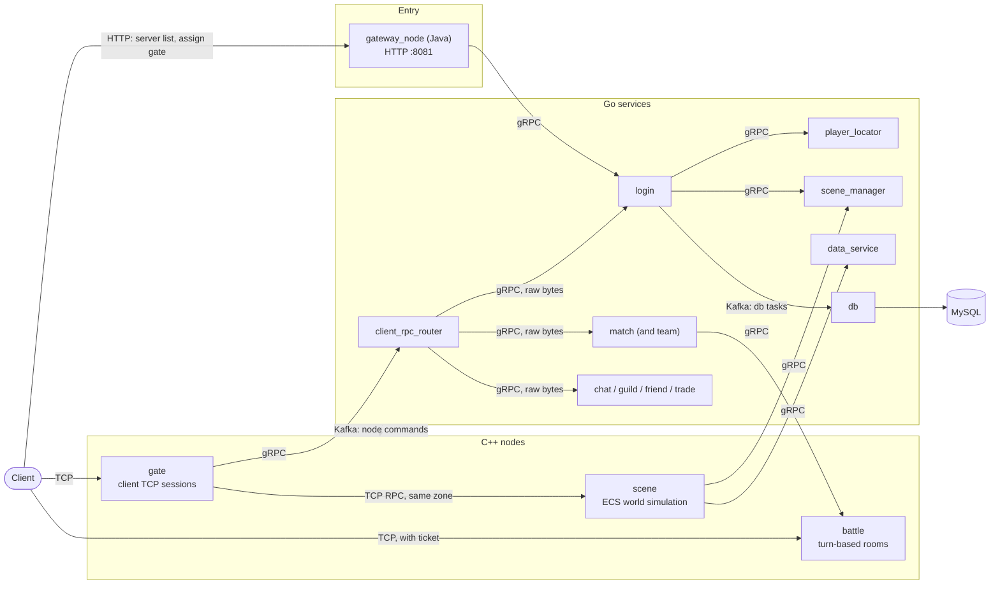

# xuanming-server-mmo

English | [简体中文](README_zh.md)

A polyglot MMORPG server: **C++** runtime nodes for the hot path, **Go** microservices for
everything stateless, and a **Java** HTTP gateway in front. Multi-zone, ECS-based scenes,
turn-based battles, and a proto-first toolchain that generates code for every language from
one set of contracts.

## Architecture



- **Login** — the client asks the Java gateway for the server list and a gate; the gateway
  calls `login` over gRPC, which picks a gate and signs a token; the client then opens a TCP
  connection to that gate.
- **In game** — `gate` keeps the client session and talks to the `scene` nodes of its zone
  over a long-lived TCP RPC connection. Requests for Go services go through a single gRPC
  target, `client_rpc_router`, which forwards the raw bytes by a generated routing table.
- **Battle** — `match` creates a room on a `battle` node over gRPC; the client connects to
  that node directly with a ticket.
- **Control plane** — services address nodes through Kafka command topics, so there is no
  full mesh of connections between services and nodes. Persistence is also asynchronous:
  `login` produces DB tasks, `db` consumes them and writes MySQL.
- **Discovery** — every node and service registers in etcd; node ids and snowflake slots
  are allocated there.

The full picture, with the reasoning behind each decision, is in
[docs/design/ARCH.md](docs/design/ARCH.md).

## Repository layout

```
.
├── cpp/                  C++ runtime nodes and engine
│   ├── nodes/            gate, scene, battle: process entry points and RPC handlers
│   ├── libs/engine/      networking, node discovery, config, Kafka and Redis clients
│   ├── libs/modules/     reusable gameplay modules: bag, currency, mission, reward ...
│   ├── libs/services/    per-node domain logic: ECS systems and components
│   ├── generated/        generated protobuf, gRPC and table code (do not edit)
│   ├── tests/            GoogleTest suites
│   └── plugin/           Clang tool that rejects raw-pointer members
├── go/                   Go microservices (go-zero), one module per service
│   ├── <service>/        login, db, data_service, scene_manager, player_locator,
│   │                     client_rpc_router, match, chat, guild, friend, trade
│   ├── shared/           libraries shared by the services
│   ├── schemamigrate/    proto-driven schema migration library
│   └── proto/            generated .pb.go (do not edit)
├── java/                 Spring Boot services; gateway_node is the HTTP entry
├── proto/                protocol contracts: the single source of truth
├── data/                 config tables (xlsx) and their schemas
├── generated/            checked-in generator outputs: table data, staging trees
├── robot/                load-test and smoke-test client
├── deploy/               Docker Compose for local infra, Kubernetes manifests
├── tools/                code generators, table exporter, engineering scripts
├── docs/                 design docs, runbooks, stress reports
├── third_party/          C++ dependencies (git submodules)
├── bin/                  working directory of the C++ nodes: configs only
├── game.sln              Visual Studio solution for all C++ projects
├── dev.bat               developer menu: build, generate, start, stop, logs
└── start-server.cmd      one-click local stack (start-game.cmd also opens the client)
```

Each top-level directory has its own `README.md` describing what is inside.

Three more directories appear once you build and run. They are git-ignored:

| Directory | Contents |
|-----------|----------|
| `build/`  | C++ intermediate files and test binaries |
| `lib/`    | C++ static libraries |
| `run/`    | logs, pid files, local secrets ([layout](docs/ops/run-directory.md)) |

### Where does new code go?

| I want to add...                  | Put it in...                                                      |
|-----------------------------------|-------------------------------------------------------------------|
| a message or RPC                  | `proto/<service>/`, then regenerate                               |
| a Go service                      | `go/<service>/` with `etc/`, `internal/` and `<service>.go`        |
| a C++ node                        | `cpp/nodes/<node>/`, starting from `cpp/nodes/_template/`         |
| scene gameplay (ECS)              | `cpp/libs/services/scene/`: `*System` classes and `*Comp` structs |
| gameplay reused by several nodes  | `cpp/libs/modules/<module>/`                                      |
| a config table                    | `data/<Sheet>.xlsx` and `data/schema/<sheet>_table.proto`         |
| an error code                     | a row in `data/tip/Tip.xlsx`; never a hand-written number         |
| a script                          | `tools/scripts/`                                                  |
| a deployment manifest             | `deploy/k8s/manifests/`                                           |
| a design document                 | `docs/design/`, then refresh the index in `docs/README.md`        |

## Services

| Service | Language | Port | Role |
|---------|----------|------|------|
| `gateway_node` | Java | HTTP 8081 | server list, gate assignment, announcements, admin API |
| `gate` | C++ | assigned per instance | client TCP sessions, token check, message relay |
| `scene` | C++ | assigned per instance | ECS world simulation, AOI, player gameplay |
| `battle` | C++ | assigned per instance | turn-based battle rooms, direct client connection |
| `client_rpc_router` | Go | 50600 | the only gRPC target of `gate`; forwards client RPCs |
| `login` | Go | 53000 | login, character creation, enter game, login queue |
| `player_locator` | Go | 53200 | session and location authority, disconnect leases |
| `scene_manager` | Go | 60300 | scene allocation, load balancing, world channels |
| `data_service` | Go | 9000 | player data, home-zone mapping, id segments, snapshots |
| `db` | Go | 6000 | consumes DB tasks from Kafka and writes MySQL |
| `match` | Go | 50500 | matchmaking and rating; also hosts the team service |
| `chat` | Go | 50700 | world channel and private chat |
| `guild` | Go | 50300 | guilds |
| `friend` | Go | 50400 | friends, block list, recommendations |
| `trade` | Go | 50800 | player marketplace |

Ports are the local defaults from each service's `etc/*.yaml`.

## Tech stack

| Layer | Technology |
|-------|------------|
| Runtime nodes | C++23, [EnTT](https://github.com/skypjack/entt) ECS, muduo networking, gRPC |
| Microservices | Go, [go-zero](https://go-zero.dev/), gRPC |
| Gateway | Java, Spring Boot 3 |
| Messaging | Kafka for commands and persistence, gRPC and TCP RPC for requests |
| Storage | MySQL, Redis |
| Discovery | etcd |
| Build | MSBuild or CMake (C++), Go modules, Maven |
| Deploy | Docker Compose (local), Kubernetes |

## Getting started

### Prerequisites

- **C++**: Visual Studio 2026 (toolset v145) on Windows, or a C++23 compiler with CMake on Linux
- **Go**: 1.26.5 or newer
- **Java**: JDK 23 and Maven
- **Tools**: PowerShell 7, Python 3 (table exporter), Docker Desktop
- **Submodules**: `git submodule update --init --recursive`

### Build

```powershell
# C++: all nodes and libraries. Keep the build serial; parallel project builds
# report spurious C1041 / LNK1104 errors.
msbuild game.sln /m:1 /p:Configuration=Debug /p:Platform=x64

# Go: all services into bin/go_services/
pwsh -File tools/scripts/dev_tools.ps1 -Command go-svc-build

# Java: gateway
cd java/gateway_node && mvn package
```

### Run locally

```powershell
# First run only: create the zone database schema
cd go/db && go run ./cmd/migrate -f etc/db.yaml -command up -create-database

# Start infrastructure, all services and one zone of gate / scene / battle
./start-server.cmd
```

`start-server.cmd` forwards to
[tools/scripts/start_game.ps1](tools/scripts/start_game.ps1). It starts etcd, Redis, MySQL
and Kafka from [deploy/docker-compose.yml](deploy/docker-compose.yml), then the Go services,
the C++ nodes and the gateway, and waits until zone 1 is open. It does not build anything.
The client entry point is `http://127.0.0.1:8081`.

`dev.bat` is the day-to-day menu for everything else: `dev.bat build`, `dev.bat status`,
`dev.bat stop`, `dev.bat logs`, `dev.bat help`. Run it without arguments for an interactive
menu.

### Generate code

```powershell
dev.bat gen       # export config tables, then regenerate protobuf code
dev.bat export    # config tables only
dev.bat proto     # protobuf code only
```

Edit the `.proto` files in `proto/` or the tables in `data/`, never the outputs. See
[proto/README.md](proto/README.md) and [data/README.md](data/README.md).

### Test

```powershell
pwsh tools/scripts/run_cpp_tests.ps1 -Build     # C++ (GoogleTest)
cd go/login && go test ./...                    # Go, per module
cd java/gateway_node && mvn test                # Java
```

The [robot](robot/README.md) client runs end-to-end smoke tests and load tests against a
running stack.

## Documentation

Start with [docs/README.md](docs/README.md): it explains how the docs are organised and
indexes every document by topic.

- [docs/design/ARCH.md](docs/design/ARCH.md) — architecture overview
- [docs/design/](docs/design/) — design decisions per service and system
- [docs/ops/](docs/ops/) — runbooks and incident reviews
- [docs/stress/](docs/stress/) — load-test reports
- [CHANGELOG.md](CHANGELOG.md) — release notes

## Contributing

Project conventions live in one place, [AGENTS.md](AGENTS.md), and apply to human and AI
contributors alike. The short version:

1. Contracts first: change `proto/` or `data/`, regenerate, then write code.
2. Never hand-edit generated files (`generated/`, `cpp/generated/`, `go/proto/`).
3. Keep RPC handlers thin and put logic in `*System` classes.
4. Record decisions in `docs/design/`.

## Client

The game client is a separate repository, checked out next to this one as
`../mmorpg-client/`. The proto generator and the table exporter write their client outputs
there; the paths are configured in `tools/proto_generator/protogen/etc/proto_gen.yaml`
(`paths.unity_client_dir`) and `tools/data_table_exporter/exporter_config.yaml`.

## License

[MIT](LICENSE)
