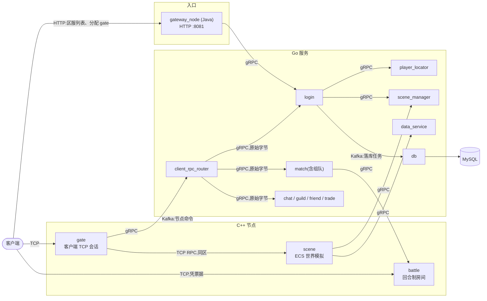

# xuanming-server-mmo

[English](README.md) | 简体中文

一套多语言的 MMORPG 服务端:热路径用 **C++** 运行时节点,无状态业务用 **Go** 微服务,最前面是
**Java** 的 HTTP 网关。支持多区(zone)、基于 ECS 的场景、回合制战斗;协议先行,同一份契约
为所有语言生成代码。

## 架构



- **登录** —— 客户端向 Java 网关要区服列表和 gate;网关经 gRPC 调 `login`,由它选 gate 并签发
  token;客户端再用 TCP 连上这台 gate。
- **游戏内** —— `gate` 持有客户端会话,通过长连接 TCP RPC 与本区的 `scene` 节点通信。发往 Go
  服务的请求只走一个 gRPC 目标 `client_rpc_router`,它按生成的路由表把原始字节转发出去。
- **战斗** —— `match` 经 gRPC 在 `battle` 节点上建房,客户端凭票据直连该节点。
- **控制面** —— 服务通过 Kafka 命令 topic 寻址节点,服务与节点之间没有全连接网。落库同样是
  异步的:`login` 生产落库任务,`db` 消费后写 MySQL。
- **服务发现** —— 所有节点和服务注册到 etcd,节点 id 与雪花 ID 槽位也在那里分配。

完整的架构说明和每个决策的理由见 [docs/design/ARCH.md](docs/design/ARCH.md)。

## 目录结构

```
.
├── cpp/                  C++ 运行时节点与引擎
│   ├── nodes/            gate、scene、battle:进程入口与 RPC 处理器
│   ├── libs/engine/      网络、节点发现、配置、Kafka 与 Redis 客户端
│   ├── libs/modules/     可复用的玩法模块:背包、货币、任务、奖励……
│   ├── libs/services/    各节点的领域逻辑:ECS 系统与组件
│   ├── generated/        生成的 protobuf、gRPC、配置表代码(勿手改)
│   ├── tests/            GoogleTest 测试
│   └── plugin/           禁止裸指针成员的 Clang 检查工具
├── go/                   Go 微服务(go-zero),一个服务一个 module
│   ├── <service>/        login、db、data_service、scene_manager、player_locator、
│   │                     client_rpc_router、match、chat、guild、friend、trade
│   ├── shared/           各服务共用的库
│   ├── schemamigrate/    以 proto 为源的建表迁移库
│   └── proto/            生成的 .pb.go(勿手改)
├── java/                 Spring Boot 服务,gateway_node 是 HTTP 入口
├── proto/                协议契约:唯一事实源
├── data/                 配置表(xlsx)及其结构定义
├── generated/            入库的生成产物:表数据、暂存树
├── robot/                压测与冒烟测试客户端
├── deploy/               本地基础设施的 Docker Compose、Kubernetes 清单
├── tools/                代码生成器、导表器、工程脚本
├── docs/                 设计文档、运维手册、压测复盘
├── third_party/          C++ 依赖(git 子模块)
├── bin/                  C++ 节点的工作目录:只放配置
├── game.sln              全部 C++ 工程的 Visual Studio 解决方案
├── dev.bat               开发菜单:编译、生成、启动、停止、看日志
└── start-server.cmd      一键启动本地整套服务(start-game.cmd 会顺带打开客户端)
```

每个顶层目录里都有自己的 `README.md`,说明里面放了什么。

编译和运行之后还会多出三个目录,它们都被 git 忽略:

| 目录 | 内容 |
|------|------|
| `build/` | C++ 中间文件与测试程序 |
| `lib/`   | C++ 静态库 |
| `run/`   | 日志、pid 文件、本机密钥([目录说明](docs/ops/run-directory.md)) |

### 新代码放哪里?

| 我要加……                | 放到……                                                        |
|-------------------------|---------------------------------------------------------------|
| 一条消息或一个 RPC      | `proto/<service>/`,然后重新生成                               |
| 一个 Go 服务            | `go/<service>/`,含 `etc/`、`internal/` 与 `<service>.go`      |
| 一个 C++ 节点           | `cpp/nodes/<node>/`,从 `cpp/nodes/_template/` 复制起步       |
| 场景玩法(ECS)         | `cpp/libs/services/scene/`:`*System` 类与 `*Comp` 结构        |
| 多个节点共用的玩法      | `cpp/libs/modules/<module>/`                                  |
| 一张配置表              | `data/<Sheet>.xlsx` 与 `data/schema/<sheet>_table.proto`      |
| 一个错误码              | 在 `data/tip/Tip.xlsx` 加一行,不手写数字                     |
| 一个脚本                | `tools/scripts/`                                              |
| 一份部署清单            | `deploy/k8s/manifests/`                                       |
| 一篇设计文档            | `docs/design/`,然后刷新 `docs/README.md` 的索引              |

## 服务一览

| 服务 | 语言 | 端口 | 职责 |
|------|------|------|------|
| `gateway_node` | Java | HTTP 8081 | 区服列表、分配 gate、公告、管理接口 |
| `gate` | C++ | 按实例分配 | 客户端 TCP 会话、校验 token、消息转发 |
| `scene` | C++ | 按实例分配 | ECS 世界模拟、AOI、玩家玩法 |
| `battle` | C++ | 按实例分配 | 回合制战斗房间,客户端直连 |
| `client_rpc_router` | Go | 50600 | `gate` 唯一的 gRPC 目标,转发客户端 RPC |
| `login` | Go | 53000 | 登录、建角、进入游戏、登录排队 |
| `player_locator` | Go | 53200 | 会话与位置的权威、断线租约 |
| `scene_manager` | Go | 60300 | 场景分配、负载均衡、世界分线 |
| `data_service` | Go | 9000 | 玩家数据、归属区映射、ID 号段、快照 |
| `db` | Go | 6000 | 消费 Kafka 里的落库任务并写 MySQL |
| `match` | Go | 50500 | 匹配与评分,组队服务也在这个进程里 |
| `chat` | Go | 50700 | 世界频道与私聊 |
| `guild` | Go | 50300 | 帮会 |
| `friend` | Go | 50400 | 好友、黑名单、推荐 |
| `trade` | Go | 50800 | 玩家寄售交易 |

端口是各服务 `etc/*.yaml` 里的本地默认值。

## 技术栈

| 层 | 技术 |
|----|------|
| 运行时节点 | C++23、[EnTT](https://github.com/skypjack/entt) ECS、muduo 网络库、gRPC |
| 微服务 | Go、[go-zero](https://go-zero.dev/)、gRPC |
| 网关 | Java、Spring Boot 3 |
| 消息 | 命令与落库走 Kafka,请求走 gRPC 与 TCP RPC |
| 存储 | MySQL、Redis |
| 服务发现 | etcd |
| 构建 | MSBuild 或 CMake(C++)、Go modules、Maven |
| 部署 | Docker Compose(本地)、Kubernetes |

## 快速开始

### 环境要求

- **C++**:Windows 上用 Visual Studio 2026(工具集 v145),Linux 上用支持 C++23 的编译器加 CMake
- **Go**:1.26.5 或更新
- **Java**:JDK 23 与 Maven
- **工具**:PowerShell 7、Python 3(导表器)、Docker Desktop
- **子模块**:`git submodule update --init --recursive`

### 编译

```powershell
# C++:全部节点与库。保持串行编译,工程并行会报假的 C1041 / LNK1104。
msbuild game.sln /m:1 /p:Configuration=Debug /p:Platform=x64

# Go:全部服务,产物在 bin/go_services/
pwsh -File tools/scripts/dev_tools.ps1 -Command go-svc-build

# Java:网关
cd java/gateway_node && mvn package
```

### 本地运行

```powershell
# 仅首次:创建区库的表结构
cd go/db && go run ./cmd/migrate -f etc/db.yaml -command up -create-database

# 启动基础设施、全部服务,以及一区的 gate / scene / battle
./start-server.cmd
```

`start-server.cmd` 转调 [tools/scripts/start_game.ps1](tools/scripts/start_game.ps1):先用
[deploy/docker-compose.yml](deploy/docker-compose.yml) 拉起 etcd、Redis、MySQL、Kafka,再启动
Go 服务、C++ 节点和网关,等到一区开放为止。它不做任何编译。客户端入口是
`http://127.0.0.1:8081`。

其余日常操作用 `dev.bat`:`dev.bat build`、`dev.bat status`、`dev.bat stop`、`dev.bat logs`、
`dev.bat help`。不带参数运行会出现交互菜单。

### 生成代码

```powershell
dev.bat gen       # 先导配置表,再重新生成 protobuf 代码
dev.bat export    # 只导配置表
dev.bat proto     # 只生成 protobuf 代码
```

只改 `proto/` 里的 `.proto` 和 `data/` 里的表,不改产物。详见
[proto/README.md](proto/README.md) 与 [data/README.md](data/README.md)。

### 测试

```powershell
pwsh tools/scripts/run_cpp_tests.ps1 -Build     # C++(GoogleTest)
cd go/login && go test ./...                    # Go,逐个 module
cd java/gateway_node && mvn test                # Java
```

[robot](robot/README.md) 客户端可以对一套运行中的服务做端到端冒烟测试和压测。

## 文档

从 [docs/README.md](docs/README.md) 读起:它说明文档怎么组织,并按主题索引了每一篇。

- [docs/design/ARCH.md](docs/design/ARCH.md) —— 架构总览
- [docs/design/](docs/design/) —— 各服务与系统的设计决策
- [docs/ops/](docs/ops/) —— 运维手册与事故复盘
- [docs/stress/](docs/stress/) —— 压测复盘
- [CHANGELOG.md](CHANGELOG.md) —— 发布说明

## 参与开发

项目规范只在一处维护:[AGENTS.md](AGENTS.md),对人和 AI 一视同仁。最要紧的四条:

1. 契约先行:先改 `proto/` 或 `data/`,重新生成,再写代码。
2. 不手改生成产物(`generated/`、`cpp/generated/`、`go/proto/`)。
3. RPC 处理器保持薄,逻辑放进 `*System` 类。
4. 决策写进 `docs/design/`。

## 客户端

游戏客户端是独立仓库,与本仓库同级检出为 `../mmorpg-client/`。协议生成器和导表器的客户端产物
都写到那里,路径分别在 `tools/proto_generator/protogen/etc/proto_gen.yaml`
(`paths.unity_client_dir`)和 `tools/data_table_exporter/exporter_config.yaml` 里配置。

## 许可证

[MIT](LICENSE)
