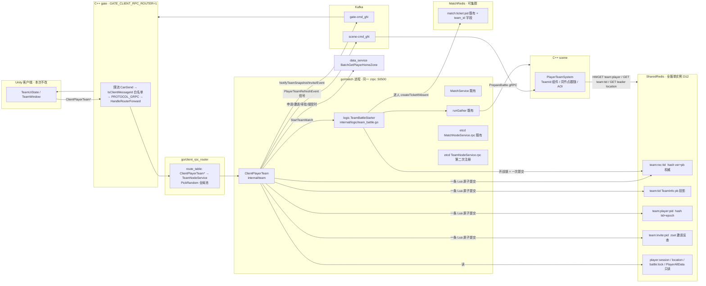

# 组队系统设计(team-in-match)

> **状态**:设计稿，还没有实现。本仓库没有据此改过任何代码，也没有编译或测试过。每一批开工前都要用户授权(AGENTS §10.2)，编译和测试由 Codex 执行(AGENTS §10.1)。
>
> **决策依据**:
> - 用户已拍板的需求:全服服务，数据按 zone_id 区分，默认 `AllowCrossZone=false`，功能全做:组队、整队排战斗、场景跟随;本次不改客户端。
> - 已有决策:`docs/design/xuanming-port-decisions-20260910.md` 的 D-2,`docs/design/xuanming-port-feasibility-20260902.md` 的 D7。
> - 五份摸底地图(match / proto-routing / scene-cpp / presence-profile / legacy-semantics)、三份候选方案、两位评委的结论。
> - 文中凡是写了 `file:line` 的代码断言，都在 2026-09-14 的工作区里亲自打开核实过。核实不了的写"待核实"。
> - 2026-09-14/15 定稿修订：三路对抗评审(并发 / 集成 / scene 生命周期)共 27 条发现，逐条打开代码核实后修订(2026-09-15 完成)。处理记录见文末"评审处理记录"。
>
> **工作区注意(2026-09-15 `git status` 实况，以下均为他人未提交/可能进行中)**:
> - 其他会话未提交的修改：`docs/design/xuanming-port-decisions-20260910.md`、`docs/design/xuanming-port-feasibility-20260902.md`、`go/chat/chat.go`(注册流程已改为"失败返回 error",HEAD 版是 `logx.Must`)、`go/guild/**`、`robot/etc/guild_smoke.yaml`、`tools/scripts/k8s_deploy.ps1`、`tools/scripts/start_game.ps1`。本文引用的 D7 原文取自工作区当前内容，可能还会变。
> - **聚宝斋 trade 会话正在改组队批 0 必须动的生成源**:`data/tip/Tip.xlsx` 已修改(openpyxl 只读核对：工作区第 208 行新增组头 `//trade_error base=20000 width=1000`,第 214 行是 `attribute_error`;team 段第 96–114 行没变);`tools/proto_generator/protogen/etc/proto_gen.yaml` 新增 `domain_meta.trade`(`:420-432`);`proto/trade/`、`go/trade/`、`go/schemamigrate/` 未跟踪,`proto/trade/jubaozhai.proto` 含客户端服务 `ClientPlayerJubaozhai` 与 `TradeAdmin`,**已在工作区生成、未提交**(2026-09-15 复核:`proto/message_id.txt` 变为 201 行,新增 `196..200` 共 5 条 `ClientPlayerJubaozhai*` / `TradeAdminSeedListing`;`cpp/generated/grpc_client/trade/`、`generated/code/proto/tip/trade_error_tip.proto` 未跟踪;`go/client_rpc_router/generated/pb/game/route_table.go`、`cpp/generated/grpc_client/grpc_init_client.cpp` 已修改);组队批 4 要改的 `robot/main.go`、`robot/config/config.go` 也被修改。
> - **组队批 3 要改的 scene 文件也有他人改动**:`cpp/libs/services/scene/battle/system/player_battle.cpp`(属性加点会话)、`cpp/libs/services/scene/scene.vcxproj{,.filters}`。本文对 `player_battle.cpp` 引用的是**工作区当前行号**,提交后可能漂移。
> - 每批开工前都要重新 `git status`,批 0 的协调要求见 §I.2。

---

## 与 D-2 / D7 的关系

| 条目 | 原文(出处) | 本设计 | 说明 |
|---|---|---|---|
| D-2 team 归属 | team 随 match 进程,`Global = $true`;`node_util.cpp` 的两个 switch 不改(port-decisions.md:35、:50) | **完全保留** | team 不新增进程、端口、镜像或 manifest(`tools/scripts/k8s_deploy.ps1:393` 的 match 条目已经是 `Global = $true`)。路由服的 `ZoneScopedNodeTypes` 不加 Team(默认只有 Login,见 `go/client_rpc_router/internal/config/config.go:44`),TeamNodeService 走全局随机选实例 |
| D7 同进程、协议独立 | `go/match` 内 `internal/team`,独立 `proto/team/team.proto` + `NODE_TEAM` + 第二次节点注册(port-feasibility.md:233、:250) | **保留** | 第二次注册改用 `shared/noderegistry.RegisterAfterListening`,见 §A.3 |
| D7 "独立 message_id 段" | 同上 | **修订**(DV-5) | 只能做到"独立 service、独立消息号"。数值由发号器从空闲号里挑(HEAD 最大号 195;工作区因 trade 未提交的生成已到 200),同一次生成里其他域也会抢号，**具体数值一律以重新生成后的 `message_id.txt` 为准** |
| D7 `BeginTeamMatch` 不作 RPC | 同上 | **保留** | 由进程内的 `logic.TeamBattleStarter` 实现 |
| D7 "覆盖 `team:{id}` + 每成员 `match:ticket` + `match:queue` 的原子事务" | 同上 | **修订**(DV-1、DV-3) | 物理上做不到，理由见 §0。改成两个原子域:队伍域在 SharedRedis 用一条 Lua;票据域做逐人 CAS 并带补偿。v1 整队开战不进队列 |
| D7 "`JoinQueueRequest` 加 `team_id`,`party_member_ids` 标 deprecated" | 同上 | **修订**(DV-4) | 不加 `team_id`,只把 `party_member_ids` 标成 deprecated。整队开战的唯一入口是 `ClientPlayerTeam.StartTeamMatch` |
| D7 验收"14 个 RPC 经 gate 可达""scene 读到 `team:<id>` 后 `aoi.cpp:27-28` 队伍跟随触发"(port-feasibility.md:167) | 同上 | **修订** | v1 是 12 个请求 RPC 加 3 个推送。`aoi.cpp:24-37` 是队友 AOI 优先级，真正的跟随逻辑在 `player_scene.cpp:265-279` |
| cross-zone-matchmaking.md D2"match 对 SharedRedis 只读"(:89) | — | **加例外**(DV-2) | 只允许 match 进程内的 team 模块写 `team:*` 四类 key,match 原有代码仍然只读 |

### 评委分歧的裁决

两位评委选的胜出方案不同。评委 0 选方案 0:权威数据放 MatchRedis 的 `{mq}` slot,队伍票据进队列装箱。评委 1 选方案 1:权威数据放 SharedRedis,整队开战走即时 gather。

**本文以方案 1 为骨架**,同时逐条修掉两位评委指出的致命缺陷，并把方案 0、方案 2 里最好的点嫁接进来。评委 0 反对 SharedRedis 的核心理由是"共享库 allkeys-lfu 按 key 淘汰，会打破一人一队"。我核实后的结论如下:

1. 按部署形态看，淘汰风险**反而在 MatchRedis 更大**:
   - K8s 的 SharedRedis 启动参数只有 `redis-server --appendonly yes`,没有设 maxmemory,等于不淘汰(`deploy/k8s/manifests/infra/redis.yaml:29-33`)。
   - K8s 的 MatchRedis 集群是 `maxmemory 512mb` + `maxmemory-policy volatile-lru`(`deploy/k8s/manifests/infra/redis-match-cluster.yaml:27-28`),**带 TTL 的 key 会被淘汰**。方案 0 的队伍 key 全都带 TTL。
   - 本地 docker 的共享库是 `maxmemory 8gb` + `allkeys-lfu`(`deploy/docker-compose.yml:230-231`),只影响开发环境。而且共享库里没有 TTL 的 `player:session:*` 本来就依赖"不淘汰"这个前提(`go/match/internal/logic/keys.go:29-32` 的注释对 MatchRedis 评分也有同样的提醒)。
2. 本设计把"单个 key 丢失"当成必须能自愈的故障来设计，不假设"永不丢失"。具体见 §C.5/§C.6:索引缺失时在 Lua 里重建，记录与索引矛盾时由 Go 侧修复;scene 读到投影缺失时回查记录，记录还在才视为"未知"，记录也不在就按无队处理(§F.2)。
3. 评委 0 在合成建议第 2 条里也同意:v1 先上"不补位整队开战(即时 gather)",补位装箱留到后面。两位评委在整队开战这一点上一致。

因此:评委 1 的骨架加上评委 0 的正确性要求(epoch 排序、投影缺失时区分"未知/无队"、AOI 降级、冻结解除后补跟随、跨节点边界),再加上方案 2 的运维项(MessageLimiter、合服 preflight、POD_IP、Timeout)。

---

## 0. 结论先行：偏离已有决策的 7 处(附硬证据)

| # | 偏离 | 本设计做法 | 硬证据(均已核实) |
|---|---|---|---|
| **DV-1** | D7"一条 Lua 覆盖 team + 成员票据 + 队列" | 拆成两个原子域:① 队伍域:SharedRedis(单实例)里一条 Lua 同时改权威记录、scene 投影、玩家索引和邀请反查索引;② 票据域:开战锁 + 逐人 `createTicketIfAbsent` + 失败时 CAS 删票 | 票据 key `match:ticket:%d` 不带 hash tag(`go/match/internal/logic/keys.go:17`、`:119-121`),队列 key 带 `{mq}`(`keys.go:13-16,24-27`),MatchRedis 是 `Type: cluster`(`go/match/etc/match_service.yaml:23-25`),Lua 跨 slot 会报 CROSSSLOT。scene 用 hiredis `GetZoneRedis()` 执行 `GET team:%llu`(`cpp/libs/services/scene/player/system/player_scene.cpp:272-278`),C++ 没有集群客户端(`go/match/internal/svc/servicecontext.go:40-43`),所以 `team:<id>` 只能放 SharedRedis |
| **DV-2** | D2"match 对 SharedRedis 只读" | 只允许 team 模块写 `team:rec:*`、`team:<id>`、`team:player:*`、`team:invite:*` 四类 key | `keys.go:34-38`、`servicecontext.go:37-44`、`match_service.yaml:9-15` 都写着"只读";scene 只能读 SharedRedis(同上) |
| **DV-3** | D7 整队"进 `match:queue`" | v1 整队开战**不进队列**，复用 PVE_SOLO 的"即时开战":成员票据直接写成 matched 态，然后调 gather,失败时全员删票。matcher、pickGroup、队列元素格式都不改。补位装箱放 v2(§E.6) | 队列元素按十进制 player_id 解析(`go/match/internal/logic/matcher.go:405`),解析失败 `playerId==0` 就当场删除(`matcher.go:438-441`),滚动升级窗口里旧实例会删掉队伍元素。PVE_SOLO 先例:`joinqueuelogic.go:169-187`。`requeueOnFail=false` 时全员 `deleteTicketIfOwned`(`gather.go:123-126`) |
| **DV-4** | D7 `JoinQueueRequest` 加 `team_id` | 不加。整队入口改为 `ClientPlayerTeam.StartTeamMatch` | 旧实例收到组队字段只打一行日志，照单人入队(`joinqueuelogic.go:57-61`)。路由服从 MatchNodeService 实例池随机选(`go/client_rpc_router/internal/logic/forwardlogic.go:198-200`),升级窗口内请求会被旧实例静默吞掉。TeamNodeService 只有新二进制才会注册，天然避开旧实例 |
| **DV-5** | D7"独立 message_id 数值段" | 放弃"数值段"的说法 | 发号器(`tools/proto_generator/protogen/internal/generator/cpp/service_register_info.go`)的真实行为(2026-09-15 读码核实，修正摸底里"最大号+1"的说法):① `MaxMessageId` = **本次解析到的方法总数**(`:69`);② 旧号只按"本次解析到的方法名"保留(`:173-185`),新方法从 `[0, MaxMessageId)` 的空闲号里取，取号顺序来自 Go map 迭代，**同批新方法之间的号序是随机的**(`:188-201`);③ `WriteMessageIdFile` 只写本次解析到的方法(`:148-166`),**没解析到的域的旧号会从 `message_id.txt` 里消失，空出来的号会被别的新方法拿走**。HEAD 是 196 行(最大号 195),工作区 trade 已生成到 200(未提交) |
| **DV-6** | 生产环境的场景跟随范围 | **只在同 zone、同 scene 节点内跟随**。跨节点、跨 zone 一律跳过，只记指标 | scene_manager 在 `AllowUnsafeCrossNodeHandoff=false` 时拒绝跨节点交接(`go/scene_manager/internal/logic/enterscenelogic.go:333-345`),该配置默认 false(`go/scene_manager/internal/config/config.go:19`),只有本地 yaml 设成 true(`go/scene_manager/etc/scene_manager_service.yaml:40`) |
| **DV-7** | 队伍"版本号" | 客户端视图按 `(membership_epoch, version)` 排序。`version` 是记录每次提交严格 +1;`membership_epoch` 按玩家维度计，只在该玩家的 team_id 变化时递增，并且在同一条 Lua 里用 Redis 自身时钟起种 | 客户端 `TeamUiState.Complete` 目前无条件覆盖快照(`E:\work\mmorpg-client\Assets\Scripts\Game\Team\TeamUiState.cs:129-138`),推送又是至多一次投递(`go/match/internal/logic/push.go:48-50`),会乱序 |

**v1 不做(YAGNI，全部列入 §J)**:陌生人补位、招募列表、准备确认、暂离/归队、跟随走位、离线成员自动移出、跨节点跟随、昵称、战斗站位槽位、队伍落 MySQL、撤回申请、`request_id` 幂等存储(改用天然幂等语义，见 §D.6)。

---

## A. 总体架构

### A.1 组件图



### A.2 各组件职责

- **team 模块**(`go/match/internal/team`)是队伍成员关系的唯一真值，负责规则判定、原子提交、视图构建、推送，并通知 scene 刷新。它不 import `logic` 包。
- **`logic.TeamBattleStarter`**(`go/match/internal/logic/team_battle.go`)把"一个队伍"变成"一组 matched 票据 + 一次 gather"。它属于票据领域代码，所以放在 `logic` 包。依赖方向是 `logic → team`;team 这边只定义 `BattleStarter` 接口，由 `match_service.go` 注入实现。
- **`playercontract` 叶子包**(`go/match/internal/playercontract`,批 1 新增)。team 需要读会话、位置、战斗锁并推送，而这些函数现在全在 `package logic` 里且未导出:`battleLockKey` / `getPlayerLocationKey` / `playerSessionKey`(`go/match/internal/logic/keys.go:134-150`)、`loadPlayerLocation`(`location.go:17`)、`loadPlayerSession` / `isSessionOnline` / `pushToPlayer`(`push.go:26-83`)。team 引用不到，反向 import 又会成环;在 team 里手抄 key 拼法则违反 §11.2 DRY(契约 key 出现第二份真相)。所以把这些"跨运行时契约 key 的拼法 + 读取 + 推送封装"迁进叶子包，导出为 `SessionKey` / `LocationKey` / `BattleLockKey` / `LoadSession` / `LoadLocation` / `IsSessionOnline` / `IsBattleLocked` / `PushToPlayer`。logic 里原函数保留为一行转调，行为不变，调用点不用改。
- **依赖图**:`logic → team → playercontract → {svc, metrics, proto}`,另有 `logic → playercontract`。`playercontract` 不 import `logic` 和 `team`。
- **scene** 只做消费方。它自己读 SharedRedis 来刷新 TeamId;Kafka 事件只是"去刷新一下"的信号，不带权威数据。
- **gate / 路由服**:C++ 源码一行不改，只需重新生成并重编(gate 白名单 `client_message_processor.cpp:883`,路由表 `route_table.go`)。

### A.3 进程装配(改 `go/match/match_service.go`)

现状：主流程先 `noderegistry.Register(MatchNodeService)`(`match_service.go:116-128`),再阻塞在 `s.Start()`(`:158`);服务端在 `:102-108` 注册，拦截器链在 `:109-112`。

改后:
1. 在 `zrpc.MustNewServer` 回调里追加 `teampb.RegisterClientPlayerTeamServer(grpcServer, team.NewServer(...))`。`sessionInterceptor`(`:165-188`)对同一个 server 上的所有 service 都生效。
2. **先起 gRPC,再注册**:照 chat 的写法(`go/chat/chat.go:94-101`),把 `s.Start()` 放到后台 goroutine,主 goroutine 等 `serveDone`。现状是 MatchNodeService 在 `s.Start()` 之前就注册(`match_service.go:116-128` 早于 `:158`),路由服可能在端口 accept 之前就选中它。
3. **两个服务都在端口可连之后才注册，顺序固定**:
   - 先注册 TeamNodeService:`shared/noderegistry.RegisterAfterListening`(`go/shared/noderegistry/registry.go:246`),它先探端口，连不上就拒绝注册(`:241-260`)。参数照 `chat.go:103-114`:
     - `Spec{Prefix: base.ENodeType_name[int32(base.ENodeType_TeamNodeService)] + ".rpc", NodeType: 10, ZoneId: c.ZoneId, LeaseTTL: c.LeaseTTL, BuildValue: nodeInfoValueBuilder(...), OnReclaimFailed: noderegistry.ReallocateNewID}`
     - `TeamNodeService = 10` 见 `proto/common/base/node.proto:15`。
     - node_id 不派生任何持久身份，所以失租换号是安全的。
   - 再注册 MatchNodeService:继续用 match 自己的 `internal/noderegistry.Register`。上一步已经确认端口可连，这里不另写探测;也不迁到 shared registry,避免顺手改变 match 的 node_id 失租语义。
   - 两者的 host 都换成 `advertisedHost(host)`。`advertisedHost` 照抄 `go/chat/chat.go:236-250`,优先读 POD_IP。这一步修掉 K8s 上把 `0.0.0.0` 原样注册进 NodeInfo 的问题(`match_service.go:116`、`:191-199`;K8s 模板 `ListenOn: 0.0.0.0:50500`,见 `tools/scripts/k8s_deploy.ps1:1904`)。
4. **注册失败的退出路径**:任一注册失败，先对已经成功的注册调 `Close()`(撤销租约，发现 key 立刻消失),再 `s.Stop()`、`logx.Close()`、`os.Exit(1)`。**不用 `logx.Must`**:它直接 `os.Exit`,defer 不执行，已写入的发现 key 要等 `LeaseTTL`(`match_service.yaml` 为 60s)才消失，这段时间路由服会持续把请求打到已退出的进程。HEAD 版 chat 就是这个写法(`git show HEAD:go/chat/chat.go` 第 122 行 `logx.Must`);工作区版 chat(未提交)已改成返回 error 并由 `lifecycle.Shutdown` 收尾(`go/chat/chat.go:190-196`),match 照"返回 error + 先 Close 已成功注册"的思路写，不照抄 HEAD 版。
5. snowflake 失租时的 fence/exit 逻辑(`:147-156`)保持不变，只在 `os.Exit(1)` 之前补上两个注册的 `Close()`,理由同上。
6. `deploy/k8s/manifests/go-svc/match.yaml` 目前的 env 只有 `GOLANG_PROTOBUF_REGISTRATION_CONFLICT`(`:64-66`),需要照 `deploy/k8s/manifests/go-svc/chat.yaml:75` 加上 `POD_IP`。
7. **match 的 zrpc `Timeout` 保持 5000,不改**。zrpc 服务端 Timeout 对同一个 server 上的所有 service 生效(`match_service.go:102-112`)。既有的 `MatchService.WatchBattle` 是一串同步 RPC:`stopWatchingIfAny`(`watchbattlelogic.go:98`)→ `addObserver`(`:180`),复查冲突时还有 `removeObserver`(`:198`),每段 3s(`spectate.go:34-35`),最坏已超过 4s。改成 4000 会把它截断成"battle 侧观战已绑定、客户端收到失败"。team 改为**自己控制请求预算**:
   - `team.server` 每个方法入口执行 `ctx, cancel := context.WithTimeout(ctx, teamRPCBudget)`,`teamRPCBudget = 3500ms`,保证赶在路由服 `ForwardTimeoutMs=5000`(`go/client_rpc_router/etc/*.yaml:32`)之前把 in-band 结果回去;
   - team 内的 Redis 和 data_service 调用一律用 Ctx 版本(go-zero `EvalCtx` / `HgetCtx` / `MgetCtx`,`core/stores/redis/redis.go:414`、`:750`、`:1148`);
   - S_COMMIT 前检查 `ctx.Err()`(§C.5 Mutate 第 3 步);
   - 补偿动作(删票、EndMatch、推送、scene 通知)用 `context.Background()` 加自身超时，不继承请求 ctx。
   - go-zero 超时拦截器到期后只是向上返回 DeadlineExceeded,handler goroutine 会继续跑完(`zrpc/internal/serverinterceptors/timeoutinterceptor.go:40-72`)。所以"迟到执行"必须靠 `expected_team_id` 和 ctx 检查兜住(§D.6),不能指望超时本身中止写入。
   - 没选 go-zero 的 `MethodTimeouts`(`zrpc/config.go:52`):要给 12 个方法各写一条，yaml 和 K8s 模板各重复一份。
   - 既有 MatchService 的"`Timeout` 5000 == `ForwardTimeoutMs` 5000"问题登记为 J-28 ⑤,不在本次处理。

### A.4 分批路线(详见 §I.2)

批 0 契约与生成 → 批 1 名册核心 → 批 2 不补位整队开战 → 批 3 scene 同节点跟随与 AOI → 批 4 冒烟与收尾。补位装箱(v2)不在本次范围内。

---

## B. proto 契约

### B.1 `proto/team/team.proto`(新增)

- 包名用 `teampb`,和 chat 的 `chatpb`、guild 的 `guildpb` 保持一致，也避开客户端已有的 `MmorpgClient.Game.Team` 命名空间(`TeamUiState.cs:5`)。
- 生成器映射节点类型的顺序是:先试 `ClientPlayerTeamNodeService`(不存在)→ 再试 `TeampbNodeService`(不存在)→ 最后按目录名 `team` 得到 `TeamNodeService`(`tools/proto_generator/protogen/internal/model.go:167-183`)。第 3 步的 `path.Base` 会去掉结尾斜杠，chat(包 `chatpb`、目录 `chat/`)已经据此得到 `ENodeType_ChatNodeService`(`go/client_rpc_router/generated/pb/game/route_table.go:39`),所以 team 必定得到 `TeamNodeService`。
- 文件级显式写 `option cc_generic_services = false;`(照 `proto/chat/chat.proto:9`、`proto/trade/jubaozhai.proto:9`)。TCP 还是 gRPC 由这个选项决定(`internal/generator/cpp/service_register_info.go:332`,未设置时为 false,见 `internal/model.go:77-85`),显式写出是为了防止以后有人误加 true 把它变成 TCP 服务。
- service 名必须带 `ClientPlayer`,Unity/robot 生成器才会收录(`internal/generator/unity/unity_client_handler.go:185`、`internal/generator/go/robot_case.go:138`)。
- 消息名避开客户端的 `TeamSnapshot` / `TeamRole`,统一叫 `TeamView` / `TeamMemberView`。
- 请求体不带 player_id,身份一律从 session 取，缺 session 就拒绝。

```proto
syntax = "proto3";
package teampb;

import "proto/db/proto_option.proto";
import "proto/common/base/empty.proto";
import "proto/common/base/tip.proto";

option go_package = "team";
option cc_generic_services = false;           // gRPC(非 muduo TCP),照 proto/chat/chat.proto:9
option (OptionFileDefaultNode) = NODE_TEAM;   // proto/db/proto_option.proto:30

// 客户端协议:gate(路由服模式) → client_rpc_router → TeamNodeService(go/match 进程)。
// 设计文档 docs/design/team-system.md。推送写成返回 Empty 的 rpc 以获得消息号
// (照 proto/match/match_service.proto:32-33),服务端实现为空操作。
service ClientPlayerTeam {
  option (OptionIsClientProtocolService) = true;

  rpc CreateTeam(CreateTeamRequest) returns (TeamResponse) {}
  rpc GetMyTeam(GetMyTeamRequest) returns (TeamResponse) {}
  rpc ApplyJoinTeam(ApplyJoinTeamRequest) returns (TeamResponse) {}
  rpc HandleApplication(HandleApplicationRequest) returns (TeamResponse) {}
  rpc InviteToTeam(InviteToTeamRequest) returns (TeamResponse) {}
  rpc RespondInvite(RespondInviteRequest) returns (TeamResponse) {}
  rpc ListMyInvites(ListMyInvitesRequest) returns (ListMyInvitesResponse) {}
  rpc LeaveTeam(LeaveTeamRequest) returns (TeamResponse) {}
  rpc KickMember(KickMemberRequest) returns (TeamResponse) {}
  rpc TransferLeader(TransferLeaderRequest) returns (TeamResponse) {}
  rpc DisbandTeam(DisbandTeamRequest) returns (TeamResponse) {}
  rpc StartTeamMatch(StartTeamMatchRequest) returns (TeamResponse) {}

  // ---- S2C 推送占位 ----
  rpc NotifyTeamSnapshot(TeamSnapshotS2C) returns (Empty) {}
  rpc NotifyTeamInvite(TeamInviteS2C) returns (Empty) {}
  rpc NotifyTeamEvent(TeamEventS2C) returns (Empty) {}
}

// ---------------- 请求 ----------------
message CreateTeamRequest {}
message GetMyTeamRequest {
  bool notify_online = 1;   // 进游戏后第一次拉取填 true:服务端把当前视图推给其他在线队员(在线态刷新)
}
// expected_team_id = 客户端当前 TeamSnapshot.TeamId。服务端只在"调用者当前所在队伍 == expected_team_id"时操作,
// 重试也绑定这个队伍、绝不换队;为 0 或不一致时不写任何东西,回 4013 并带调用者当前视图
// (LeaveTeam 例外:回成功,见 §D.6)。作用:超时后迟到执行的旧请求不能误伤调用者后来加入的新队伍。
message ApplyJoinTeamRequest     { uint64 target_player_id = 1; }  // 申请加入"该玩家所在的队伍"
message HandleApplicationRequest { uint64 applicant_id = 1; bool approve = 2; uint64 expected_team_id = 3; }
message InviteToTeamRequest      { uint64 target_player_id = 1; uint64 expected_team_id = 2; }
message RespondInviteRequest     { uint64 team_id = 1; bool accept = 2; }   // team_id 本身已绑定队伍
message ListMyInvitesRequest {}
message LeaveTeamRequest         { uint64 expected_team_id = 1; }
message KickMemberRequest        { uint64 target_player_id = 1; uint64 expected_team_id = 2; }
message TransferLeaderRequest    { uint64 target_player_id = 1; uint64 expected_team_id = 2; }
message DisbandTeamRequest       { uint64 expected_team_id = 1; }
message StartTeamMatchRequest    { uint32 battle_config_id = 1; uint64 expected_team_id = 2; }  // DungeonTable id;模式固定 PVE_TEAM

// ---------------- 回包 / 显示层视图(§11.6:在线态只出现在这里) ----------------
message TeamResponse {
  TipInfoMessage error_message = 1;  // id=0 成功;非 0 时 team 仍可能携带调用者当前视图(取自调用者自己的同一次 S_READ,照常按 §H.3 应用)
  TeamView team = 2;                 // 调用者视角;无队伍时 team_id=0
}

message ListMyInvitesResponse {
  TipInfoMessage error_message = 1;
  repeated TeamIncomingInviteView invites = 2;
  uint64 server_time_ms = 3;
}

enum TeamMatchState {
  TEAM_MATCH_STATE_IDLE = 0;
  TEAM_MATCH_STATE_STARTING = 1;     // 开战锁有效:gather 在途,名单冻结
}

message TeamMemberView {
  uint64 player_id = 1;
  string name = 2;          // 仓库暂无昵称,恒为 ""(§G.2)
  uint32 level = 3;         // 尽力而为,0 = 未知
  uint32 class_id = 4;      // 尽力而为,0 = 未知
  uint32 gender = 5;        // v1 恒 0(性别只在账号 blob);客户端头像因此不可推导,见 §H.4
  bool is_leader = 6;
  bool is_online = 7;       // 读时由 player:session 算,仅 SESSION_STATE_ONLINE 为 true
  bool in_battle = 8;       // 读时由 battle:lock 算(咨询性)
  uint32 zone_id = 9;       // 玩家 home zone
  uint32 join_seq = 10;     // 显式顺序(§11.6);members 已按它升序,但客户端不得依赖下标
}

message TeamApplicationView {
  TeamMemberView player = 1;
  uint64 applied_at_ms = 2;
  uint64 expire_at_ms = 3;
}

message TeamOutgoingInviteView {     // 队长看到的"已发出邀请"
  TeamMemberView invitee = 1;
  uint64 expire_at_ms = 2;
}

message TeamIncomingInviteView {     // 被邀请人看到的"收到的邀请"
  uint64 team_id = 1;
  TeamMemberView inviter = 2;
  uint64 leader_id = 3;
  uint32 member_count = 4;
  uint32 zone_id = 5;
  uint64 expire_at_ms = 6;
}

message TeamView {
  uint64 team_id = 1;                 // 0 = 无队伍
  uint64 leader_id = 2;
  uint32 capacity = 3;                // 恒 5
  uint32 zone_id = 4;                 // 建队者 home zone
  uint64 version = 5;                 // 队伍记录版本,每次提交严格 +1;无队伍时 0
  uint64 membership_epoch = 6;        // 接收者本人的成员关系版本(§C.4);排序键 (membership_epoch, version)
  TeamMatchState match_state = 7;
  repeated TeamMemberView members = 8;
  repeated TeamApplicationView applications = 9;          // 只下发给队长
  repeated TeamOutgoingInviteView pending_invites = 10;   // 只下发给队长
  uint32 application_count = 11;      // 所有成员可见
  uint64 server_time_ms = 12;         // 倒计时基准(SharedRedis TIME,§C.4),避免客户端时钟偏差
}

enum TeamChangeReason {
  TEAM_CHANGE_REASON_UNSPECIFIED = 0;
  TEAM_CHANGE_REASON_CREATED = 1;
  TEAM_CHANGE_REASON_MEMBER_JOINED = 2;
  TEAM_CHANGE_REASON_MEMBER_LEFT = 3;
  TEAM_CHANGE_REASON_MEMBER_KICKED = 4;           // 被踢者收到 team_id=0 的视图
  TEAM_CHANGE_REASON_LEADER_TRANSFERRED = 5;
  TEAM_CHANGE_REASON_LEADER_OFFLINE_TRANSFERRED = 6;
  TEAM_CHANGE_REASON_DISBANDED = 7;               // 全员收到 team_id=0 的视图
  TEAM_CHANGE_REASON_APPLICATION_CHANGED = 8;     // 申请增减(队长)
  TEAM_CHANGE_REASON_INVITE_CHANGED = 9;          // 邀请增减/被拒(队长)
  TEAM_CHANGE_REASON_MEMBER_ONLINE = 10;          // 在线态刷新,version 不变
  TEAM_CHANGE_REASON_MATCH_STARTED = 11;
  TEAM_CHANGE_REASON_MATCH_ENDED = 12;            // 开战成功;客户端随后收到既有 BattleStartS2C
  TEAM_CHANGE_REASON_MATCH_FAILED = 13;           // tip 字段带原因
  TEAM_CHANGE_REASON_HEALED = 14;                 // 服务端自愈(索引/记录矛盾修复)
}

message TeamSnapshotS2C {
  TeamView team = 1;
  TeamChangeReason reason = 2;
  uint64 actor_id = 3;         // 触发者(加入者/离队者/被踢者/新队长…),0 = 系统
  TipInfoMessage tip = 4;      // 可选:MATCH_FAILED 的原因码(parameters[0] 可能是出问题的 player_id)
}

message TeamInviteS2C {
  TeamIncomingInviteView invite = 1;
  uint64 server_time_ms = 2;
}

enum TeamEventType {
  TEAM_EVENT_TYPE_UNSPECIFIED = 0;
  TEAM_EVENT_TYPE_APPLICATION_REJECTED = 1;  // 发给被拒申请人(他不在队里,收不到视图)
  TEAM_EVENT_TYPE_INVITE_REVOKED = 2;        // 发给被邀请人:队伍解散/满员导致邀请失效
}

// 轻量提示:只给"没有视图可推"的接收者,不带状态,客户端只弹 toast。
message TeamEventS2C {
  TeamEventType type = 1;
  uint64 team_id = 2;
  uint64 actor_id = 3;
}

// ---------------- 存储记录(Redis 值,不下发客户端) ----------------
// 实例层:只描述"队伍是谁、成员是谁";不含在线态、站位、槽位(AGENTS §11.6)。
// 版本号存 team:rec 的 hash 字段 ver,不在 pb 里重复。
message TeamRecord {
  uint64 team_id = 1;
  uint64 leader_id = 2;
  uint32 zone_id = 3;
  uint64 created_at_ms = 4;
  repeated TeamMemberRecord members = 5;          // 集合语义,顺序看 join_seq
  repeated TeamApplicationRecord applications = 6;
  repeated TeamInviteRecord invites = 7;
  uint32 next_join_seq = 8;
  string match_lock_token = 9;                    // 非空 = 开战锁持有者(uuid)
  uint64 match_lock_expire_at_ms = 10;            // 过期视为无锁(SharedRedis TIME 口径,§C.4)
  repeated uint64 match_lock_roster = 11;         // 集合语义:加锁时的开战名单;锁有效期间必等于 members 的 player_id 集合
}
message TeamMemberRecord      { uint64 player_id = 1; uint32 zone_id = 2; uint64 joined_at_ms = 3; uint32 join_seq = 4; }
message TeamApplicationRecord { uint64 player_id = 1; uint32 zone_id = 2; uint64 applied_at_ms = 3; uint64 expire_at_ms = 4; }
message TeamInviteRecord      { uint64 invitee_id = 1; uint64 inviter_id = 2; uint32 zone_id = 3; uint64 invited_at_ms = 4; uint64 expire_at_ms = 5; }
```

字段类型遵守 AGENTS §4:player_id、team_id 和所有 `*_ms` 用 uint64;zone_id、join_seq 用 uint32;所有枚举首值为 0。

### B.2 `proto/common/event/team_event.proto`(新增，发往 scene 的信号)

```proto
syntax = "proto3";
option go_package = "common/event";

// team(match 进程)→ scene:某玩家的组队成员关系可能变了,请自己重读 SharedRedis。
// 载荷不携带权威数据:乱序、重复、丢失都安全(下次进场会再拉,§F.2)。
// Kafka:topic = scene-cmd_g<N>,partition = scene_node_id % P,key = player_id(AGENTS §7 #3);
// SceneCommand{DispatchEvent, player_id, target_scene_id = scene_node_id, target_instance_id = 目标 uuid, event_id}。
message PlayerTeamRefreshEvent {
  uint64 player_id = 1;
}
```

- `proto/common/event/` 在生成器配置里登记为 `logic_event`(`tools/proto_generator/protogen/etc/proto_gen.yaml:172`、`:216`),会生成 scene 侧的 `cpp/nodes/scene/handler/event/team_event_handler.{h,cpp}`(目录见 `proto_gen.yaml:79-80`)。
- 事件号由生成器发，预计是 48,当前 `proto/event_id.txt` 最大号 47。Go 侧常量形如 `game.PlayerTeamRefreshEventEventId`,参考 `go/match/generated/pb/game/event_id.go:45` 的 `BattleSettlementEventEventId`。
- 字段定义见 `proto/contracts/kafka/scene_command.proto:8-19`。

### B.3 `proto/common/component/team_comp.proto`(修改)

```proto
message TeamId
{
  uint64 team_id = 1;
  uint64 membership_epoch = 2;   // 新增:scene 仅当 incoming epoch 更大时才改组件(§F.2)
}

// Redis team:<team_id> 的投影值(scene 读,team 服务在同一条 Lua 里写)。
// members 是集合语义,scene 不得依赖顺序(AGENTS §11.6)。
message TeamInfo
{
  uint64 team_id = 1;
  uint64 leader_id = 2;
  repeated uint64 members = 3;
}
```

现状:`TeamId{team_id=1}`、`TeamInfo{team_id, leader_id, repeated members}`(`team_comp.proto:6-16`)。新增 2 号字段不影响 `aoi.cpp:27-31` 和 `aoi_system_test.cpp:431-434` 只用 `team_id` 的写法。

### B.4 `proto/match/match_service.proto`(修改)

```proto
message JoinQueueRequest {
  uint64 player_id = 1;
  MatchMode mode = 2;
  uint32 map_config_id = 3;
  // 从未生效(joinqueuelogic.go:57-61);整队开战走 ClientPlayerTeam.StartTeamMatch(docs/design/team-system.md DV-4)
  repeated uint64 party_member_ids = 4 [deprecated = true];
  uint32 zone_id = 5;
  uint32 battle_config_id = 6;
}
```

现状:`party_member_ids = 4` 在 `match_service.proto:68`。这次只加注释和 option,线上兼容。**不加** `team_id`。

### B.5 生成器配置(`tools/proto_generator/protogen/etc/proto_gen.yaml`)

- 照 `domain_meta.match` 块的写法在 `domain_meta` 下加 `team:`:`source: "{{proto_dir}}team/"`,`rpc.type: grpc`;go 输出 proto/handler/grpc;cpp 输出 proto 和 grpc。(工作区里 trade 会话在 `:420-432` 插入了 `trade:` 块，其后的行号都后移了 14 行，所以这里不写行号。)
- `"team/"` 已经在 `path_lists`(`:184`)和 `proto_dirs`(`:226`)里，不用加。
- **漏加 `domain_meta.team` 的后果**:生成器只遍历 `domain_meta[].source` 收集 .proto(`internal/prototools/descriptor.go:73-115`),team.proto 根本不会被解析，没有消息号，也没有路由表条目。客户端发来的包在 gate 被 `IsClientMessageId` 拒掉并计入非法包，超过 `GATE_ILLEGAL_PACKET_THRESHOLD` 直接断开连接(`cpp/nodes/gate/handler/rpc/client_message_processor.cpp:880-893`),现象是"未知 message_id / 被踢下线"。它**不会**"走 TCP":TCP 还是 gRPC 只由文件级 `cc_generic_services` 决定(§B.1)。
- `enable_unity_client: true`(`:243`)会改写 `../mmorpg-client/Assets/Scripts/Net/Generated/`(`:29-31`)。**Codex 必须用关闭这个开关的配置副本来生成**(§I.6)。
- 副作用:每个 grpc 域**必定**生成 `go/<目录名>/generated/pb/game/`。`internal/message_id.go:190-206` 按 `filepath.Base(meta.Source)` 拼目录,`:99-107` 用 `MkdirAll` 建目录，现有 chat/match/guild 等 9 个目录都是这样来的。所以一定会多出 `go/team/generated/pb/game/`,本设计接受它，并在文档注明"不是独立服务"(J-15)。
- **编辑冲突**:trade 会话也在改这个文件(未提交)。先后顺序按 §I.2 批 0 前置条件协调。

---

## C. 存储

### C.1 key 全表

| key | 类型 | 内容 | TTL | 所在库 | 读者 | 写者 |
|---|---|---|---|---|---|---|
| `team:rec:<team_id>` | hash | `ver`(十进制 uint64,严格 +1)、`pb`(TeamRecord 字节) | `TeamIdleTTL` 24h,每次提交或触碰续期 | **SharedRedis** | team | team(只通过 Lua) |
| `team:<team_id>` | string | `TeamInfo` pb(team_comp.proto:11-16) | 同上，在同一条 Lua 里写 | **SharedRedis** | C++ scene(`player_scene.cpp:278` 的 key 格式是既有契约，不带花括号) | team(同一条 Lua) |
| `team:player:<player_id>` | hash | `tid`(十进制，无队伍为 `"0"`)、`epoch`(十进制) | 24h,每次提交续期;**离队后不删除，只把 tid 置 0**,保留 epoch | **SharedRedis** | team、C++ scene | team(只通过 Lua) |
| `team:invite:<player_id>` | zset | member=team_id,score=expire_at_ms | 每次 ZADD 后 `EXPIRE 3600` | **SharedRedis** | team(ListMyInvites) | team(提交 Lua 写;ListMyInvites 用 S_INVITE_LIST 剔除过期项、S_INVITE_PRUNE 条件删除，见 §C.5) |
| `match:ticket:<player_id>` | hash | 既有字段(`queue.go:246-257`)加上 **`team_id`**(新增，只用于观测) | 既有:matched 用 `matchedTicketTTLFor(n)`(`queue.go:327-338`),ready 60s | MatchRedis | match | match |
| `player:session:<id>` / `player:<id>:location` / `battle:lock:<id>` | 既有 | 既有 | 既有 | SharedRedis | team、match、scene | 各既有写者 |
| `<PlayerAllData 全名>:<id>` | string | `PlayerAllData` pb(key 拼法见 `go/login/internal/logic/clientplayerlogin/player_class_backfill.go:26-27`) | 既有 | SharedRedis(login 的 `RedisClient` 本地是 127.0.0.1:6379,`go/login/etc/login.yaml:29-30`,与 match 的 `Redis` 同址) | team(只取展示字段，尽力而为) | login/db |

**不新增**:扫描器用的集合、招募索引、幂等键。申请和邀请的正文都存在 `TeamRecord` 里(每队上限各 10 条);`team:invite:<pid>` 只是反查索引。

### C.2 为什么权威数据放 SharedRedis(DV-1/DV-2)

1. **scene 只能读 SharedRedis**,投影 `team:<id>` 必须放在这里(`player_scene.cpp:91-97`、`:272-278`)。
2. **单实例可以用一条 Lua 同时改记录、投影、索引**,投影和权威不会脱节。不需要方案 0 那一套"跨实例投影 CAS + 墓碑 + 修复"。
3. **淘汰风险按部署形态比较，结论见上文"评委分歧的裁决"**:K8s 的 SharedRedis 不淘汰，而 K8s 的 MatchRedis 会淘汰带 TTL 的 key。
4. **容量**:1 万队 × 约 2KB ≈ 20MB,写 QPS 在百级，和共享库现有的会话、位置 key 同一量级。
5. **代价**:
   - 打破 D2 的"只读"约定，需要在 `cross-zone-matchmaking.md` 的 D2 和 `keys.go` 的头注释里各写一条例外。
   - 这条 Lua 同时操作多个 key,如果将来 SharedRedis 集群化，要么全部加 hash tag,要么拆分。需要登记进 `cross-zone-matchmaking.md` §10.0 的"共享库禁止集群化清单"(J-25)。
   - 队伍不落 MySQL。共享库如果丢数据，队伍会全部消失，玩家重新组队即可。队伍本身就是会话级数据，这个代价可以接受。

### C.3 team_id 发号

- 复用 `svcCtx.BattleIDGen.Generate()`(`go/match/internal/svc/servicecontext.go:57-61`)。它的槽位按 snowflakealloc 的 kind=`"match"` 独立申领(`:103-113`),与 NodeInfo 的 node_id 解耦。
- **AGENTS §7 #1(SnowFlake 节点隔离)**:team_id 只由 match 进程生产，与 battle_id、challenge_id 共用同一个生成器，同一个生成器发出的号不会重复。第二次注册 TeamNodeService 不涉及 snowflake 槽位。
- 失租被 fence 后 `Generate` 返回错误,CreateTeam 回 `kTeamInternal`,不许用 0 顶替(照 `gather.go:133-135`)。
- 同批把 `servicecontext.go:57-61` 的注释更新为"battle_id / challenge_id / team_id"。

### C.4 版本与 epoch(DV-7)

- **`ver`**:队伍记录每次提交严格 +1,首次提交从 1 开始。触碰续期(S_TOUCH)不改 ver。
- **`epoch`**:玩家维度，只在该玩家的 `tid` 变化时递增。取值规则:
  - key 存在时，新 epoch = 旧 epoch + 1;
  - key 缺失时(24h 过期或被淘汰)用 Redis 自身时钟 `TIME` 起种，新 epoch = 当前毫秒数。Redis 7.2 默认 effects replication,脚本里可以调 `TIME`;本地是 `redis:latest`,K8s 是 `redis:7.2`(`deploy/docker-compose.yml:218`、`deploy/k8s/manifests/infra/redis.yaml:29`)。
  - SharedRedis 是单实例，时钟只有一个，不存在多个 Go 实例之间的时钟偏差问题。
- **客户端排序键** `(membership_epoch, version)`:
  - epoch 解决跨队乱序。例如"加入 B 队"的推送先到,"被 A 队踢出"的推送后到，后者 epoch 更小，会被丢弃。
  - version 解决同队内乱序。
  - 空视图(team_id=0)的 version 为 0,epoch 为本人最新值。
  - **前提**:排序键只有在 `(epoch, team_id, version)` 出自同一次原子读时才成立。服务端保证：提交后的推送用 S_COMMIT 返回的 epoch;不经提交的推送(`GetMyTeam{notify_online}`)用 S_READ_MEMBERS;失败回包里的视图用调用者自己的 S_READ。任何视图都不许把"某一时刻读到的记录"和"另一时刻读到的 epoch"拼在一起。
  - 由此得到一条客户端冲突判定：对同一个接收者,epoch 相等则 team_id 必然相等。所以 `incoming.epoch == cur.epoch` 但 team_id 不同，说明其中一方来源不一致，丢弃这条并重新 GetMyTeam(§H.3)。
- **唯一时钟源**:epoch 起种、申请和邀请的 `expire_at_ms`、`applied_at_ms` / `invited_at_ms` / `joined_at_ms`、开战锁 `match_lock_expire_at_ms`、视图 `server_time_ms`,**全部取 SharedRedis 的 `TIME`**(S_READ、S_COMMIT、S_INVITE_LIST 都返回 nowMs;`rules.Apply` 的 now 就是它)。match 是全服多实例，各实例的 Go 墙钟有偏差：偏快的实例会提前认为开战锁已过期，在 gather 途中放行离队、踢人、解散。所以不能用 Go 墙钟写或比较跨进程的绝对截止时间(AGENTS §11.3)。进程内的超时预算照常用单调时钟。
- **Lua 数字精度**:毫秒时间戳是 13 位，写回时用 `string.format("%.0f", e)`,避免 Lua 默认的 `%.14g` 在 14 位以上丢精度。

### C.5 Lua 脚本(`go/match/internal/team/scripts.go`)

Go 侧统一走"先读、在 Go 里算规则、再用 Lua 按 CAS 写"的模式，与 match 现有写法一致(`queue.go:106-123`、`:396-404`)。

**S_COMMIT(唯一的写脚本)**

```lua
-- KEYS[1]=team:rec:<tid>  KEYS[2]=team:<tid>
-- 其后依次:nJ 个新加入成员的 team:player:<pid>
--          nK 个保留成员的 team:player:<pid>
--          nL 个移出成员的 team:player:<pid>
--          nIA 个新增/刷新邀请的 team:invite:<pid>
--          nID 个删除邀请的 team:invite:<pid>(Go 侧保证 ID ∩ IA = ∅,见下文 Mutate 第 3 步)
-- ARGV[1]=expectedVer:"new" = 建队专用,记录必须不存在;其余操作必须是现有记录的十进制 ver(≥1)
-- ARGV[2]=recPb(""=解散:删 K1/K2)  ARGV[3]=projPb  ARGV[4]=ttlSec  ARGV[5]=tid
-- ARGV[6..10]=nJ,nK,nL,nIA,nID   ARGV[11..10+nIA]=每个新增邀请的 expire_at_ms
-- ARGV[11+nIA]=每个被邀请人的待处理邀请上限(10)
-- 返回 {1,newVer,epoch_1..epoch_(nJ+nK+nL)} | {0} 版本冲突或记录已不存在 | {-1,i} 新成员已在他队
--      | {-2,i} 保留成员索引与记录矛盾 | {-3,i} 第 i 个被邀请人的待处理邀请已达上限
local cur = redis.call("HGET", KEYS[1], "ver")
if ARGV[1] == "new" then
  if cur then return {0} end
elseif (not cur) or cur ~= ARGV[1] then
  return {0}          -- 非建队操作遇到"记录已删除"一律冲突,绝不把已解散的队伍复活
end
local tid = ARGV[5]
local ttl = tonumber(ARGV[4])
local nJ, nK, nL = tonumber(ARGV[6]), tonumber(ARGV[7]), tonumber(ARGV[8])
local nIA, nID = tonumber(ARGV[9]), tonumber(ARGV[10])
local inviteCap = tonumber(ARGV[11 + nIA])
local t = redis.call("TIME")
local nowms = tonumber(t[1]) * 1000 + math.floor(tonumber(t[2]) / 1000)
-- 先判后写:任何拒绝分支都不产生写入(判定段只用 HGET / ZSCORE / ZCOUNT 只读命令)
for i = 1, nJ do
  local v = redis.call("HGET", KEYS[2 + i], "tid")
  if v and v ~= "0" and v ~= tid then return {-1, i} end
end
for i = 1, nK do
  local v = redis.call("HGET", KEYS[2 + nJ + i], "tid")
  if v and v ~= tid then return {-2, i} end    -- 缺失(nil)允许,下面重建
end
local base = 2 + nJ + nK + nL
for i = 1, nIA do                                -- 被邀请人上限与提交同一原子操作(替代 pre 阶段的 ZCARD)
  local key = KEYS[base + i]
  if not redis.call("ZSCORE", key, tid) then     -- 已有本队条目 = 刷新,不占新名额
    if redis.call("ZCOUNT", key, "(" .. string.format("%.0f", nowms), "+inf") >= inviteCap then
      return {-3, i}
    end
  end
end
local function setIdx(key, v)
  local old = redis.call("HGET", key, "tid")
  local e = tonumber(redis.call("HGET", key, "epoch") or "0")
  if old ~= v then
    if e == 0 then e = nowms else e = e + 1 end
    redis.call("HSET", key, "tid", v, "epoch", string.format("%.0f", e))
  end
  redis.call("EXPIRE", key, ttl)
  return string.format("%.0f", e)
end
local out = {1, 0}
local newVer = (tonumber(cur) or 0) + 1
out[2] = string.format("%.0f", newVer)
if ARGV[2] == "" then
  redis.call("DEL", KEYS[1], KEYS[2])
else
  redis.call("HSET", KEYS[1], "ver", out[2], "pb", ARGV[2])
  redis.call("EXPIRE", KEYS[1], ttl)
  redis.call("SET", KEYS[2], ARGV[3], "EX", ttl)
end
for i = 1, nJ + nK do out[#out + 1] = setIdx(KEYS[2 + i], tid) end
for i = 1, nL do
  local key = KEYS[2 + nJ + nK + i]
  if redis.call("HGET", key, "tid") == tid then
    out[#out + 1] = setIdx(key, "0")
  else
    out[#out + 1] = redis.call("HGET", key, "epoch") or "0"
  end
end
-- 先删后加:即使 Go 侧漏了 ID := ID \ IA,同一个人也不会出现"刚 ZADD 就被 ZREM"(过期后重邀同一人)
for i = 1, nID do redis.call("ZREM", KEYS[base + nIA + i], tid) end
for i = 1, nIA do
  redis.call("ZADD", KEYS[base + i], ARGV[10 + i], tid)
  redis.call("EXPIRE", KEYS[base + i], 3600)
end
return out
```

**S_READ(一致性读，带 Redis 时钟)**

```lua
-- KEYS[1]=team:player:<pid>  KEYS[2]=team:rec:<t>
-- 返回 {tidNow, epoch, ver, pb, recTTL, nowMs}(nowMs 用字符串返回,避免 Lua 数字转换)
local tidNow = redis.call("HGET", KEYS[1], "tid") or ""
local epoch = redis.call("HGET", KEYS[1], "epoch") or "0"
local r = redis.call("HMGET", KEYS[2], "ver", "pb")
local t = redis.call("TIME")
local nowms = tonumber(t[1]) * 1000 + math.floor(tonumber(t[2]) / 1000)
return {tidNow, epoch, r[1] or "", r[2] or "", redis.call("TTL", KEYS[2]), string.format("%.0f", nowms)}
```

t 的来源分三种模式(由 Go 侧 `store` 决定，调用方不拼装):
- **绑定调用者队伍**(`bindCaller(pid, expectedTid)`,用于带 `expected_team_id` 的写 RPC):t = expectedTid。`expectedTid == 0` 或 `tidNow ≠ expectedTid` 时**不写任何东西**,返回"未绑定"(见 Mutate 第 1 步)。重试也只读这个 t,绝不换队。
- **绑定目标队伍**(`bindTarget(pid, tid)`,用于 RespondInvite 的 `team_id`、ApplyJoinTeam 在 pre 阶段读到的目标 tid):t = tid;`tidNow` 只交给规则判断"调用者是否已在别的队"。
- **自由读**(GetMyTeam、CreateTeam 预检、失败回包里的调用者视图):Go 先 `HGET team:player:<pid> tid` 得到预读值 t,再执行脚本;返回的 `tidNow ≠ t` 时重试，最多 3 次，保证调用者的 epoch 和记录的 ver 出自同一次原子读。

**S_READ_MEMBERS(给其他队员构建不经提交的视图)**

```lua
-- KEYS[1]=team:rec:<tid>  KEYS[2..]=Go 按上一次读到的成员表传入的 team:player:<m>
-- 返回 {ver, pb, nowMs, tid_1, epoch_1, tid_2, epoch_2, ...}
local r = redis.call("HMGET", KEYS[1], "ver", "pb")
local t = redis.call("TIME")
local out = {r[1] or "", r[2] or "", string.format("%.0f", tonumber(t[1]) * 1000 + math.floor(tonumber(t[2]) / 1000))}
for i = 2, #KEYS do
  out[#out + 1] = redis.call("HGET", KEYS[i], "tid") or ""
  out[#out + 1] = redis.call("HGET", KEYS[i], "epoch") or "0"
end
return out
```
- Go 解析 pb 后核对"记录里的成员集合 == 传入的 key 集合",不等就用新成员表重读，最多 3 次，仍不等就放弃这次推送(记 `team_push_total{kind="members_changed"}`)。
- **只给 `tid_i == 本队 tid` 的成员推送**,使用这次读到的 `epoch_i`;tid 不等的成员(已离队、索引缺失)不推，交给他们自己的拉取自愈。
- 用于 `GetMyTeam{notify_online}` 推给其他在线队员，以及任何"不是由 S_COMMIT 返回 epoch"的推送。

**S_INVITE_LIST / S_INVITE_PRUNE(ListMyInvites 专用，单 key)**

```lua
-- S_INVITE_LIST:KEYS[1]=team:invite:<pid>;返回 {nowMs, tid_1, score_1, ...}
local t = redis.call("TIME")
local nowms = tonumber(t[1]) * 1000 + math.floor(tonumber(t[2]) / 1000)
redis.call("ZREMRANGEBYSCORE", KEYS[1], "-inf", string.format("%.0f", nowms))
local out = {string.format("%.0f", nowms)}
local z = redis.call("ZRANGE", KEYS[1], 0, -1, "WITHSCORES")
for i = 1, #z do out[#out + 1] = z[i] end
return out

-- S_INVITE_PRUNE:KEYS[1]=team:invite:<pid>  ARGV[1]=tid  ARGV[2]=S_INVITE_LIST 看到的 score 原字符串
-- 只有 score 没变(期间没有被重邀刷新)才删,避免删掉队长刚写入的新索引项
local s = redis.call("ZSCORE", KEYS[1], ARGV[1])
if s and s == ARGV[2] then redis.call("ZREM", KEYS[1], ARGV[1]) return 1 end
return 0
```

**S_TOUCH(续期，不改 ver)**:`KEYS=[K1,K2,成员 K3...]`,`ARGV=[expectedVer, ttl]`。ver 一致才对所有 key 执行 EXPIRE。GetMyTeam 发现记录 TTL < 12h 时调用。

**S_HEAL_ORPHAN(孤儿索引)**:`KEYS=[team:player:<pid>, team:rec:<tid>]`,`ARGV=[tid, ttl]`。条件是记录不存在且索引 tid 等于 ARGV tid,满足时把 tid 置 0、epoch+1,返回 1;否则返回 0。

**Go 侧 `store.Mutate(ctx, bind, op)` 循环**(建队走 `expectedVer="new"`;StartTeamMatch 的加锁与 EndMatch **不走**这个重算循环，见 §E.1):
1. 按 `bind` 执行 S_READ(模式见上)。
   - **未绑定**(bindCaller 且 `tidNow ≠ expectedTid`):不写，返回 `errNotBound`。server 层回 4013(LeaveTeam 回成功，见 §D.6),视图取调用者自己的一次"自由读"。
   - **记录不存在**(`ver == ""`):非建队操作**一律不进入 S_COMMIT**。bindCaller 且 `tidNow == tid` → S_HEAL_ORPHAN 并通知该玩家的 scene(§F.3),回 4013 + 空视图(LeaveTeam 回成功 + 空视图，与 §D.6 一致);bindTarget → 回 4013(RespondInvite 顺手 S_INVITE_PRUNE)。
   - 再 `MGET player:session:<成员>` 取在线态，供惰性转让队长(§D.7)使用。
2. 调纯函数 `rules.Apply(op, rec, nowMs, sessions, cfg)`,`nowMs` 就是 S_READ 返回的 Redis 时钟(§C.4 唯一时钟源),得到新记录、成员增减集、邀请增减集，或者一个 tip 错误。这一步没有 I/O,可以表驱动单测。
3. 整理提交集合并提交:
   - **`ID := ID \ IA`**。清理过期邀请时被清掉的被邀请人进入 ID;同一次操作又重邀此人时他进入 IA,两者去重后只留在 IA。
   - `expectedVer` 固定为本轮 S_READ 读到的 ver。
   - **`ctx.Err() != nil` 时放弃提交**,回 `kTeamStateChanged`。这挡住"请求已超时、handler 仍在跑"的大部分迟到写入;检查与 EVAL 之间仍有微小窗口，真正兜底的是第 1 步的绑定校验。
   - 序列化记录和投影后执行 S_COMMIT,按返回值处理:
     - `{1,…}`:成功，返回的 epoch 用于构建推送视图。
     - `{0}`:回到第 1 步(重新做绑定校验，所以重试不会换队、也不会在已删除的记录上重建),最多 3 次;全部失败回 `kTeamStateChanged`。
     - `{-1,i}`:第 i 个新成员已经在别的队，回 `kTeamMemberInTeam`,parameters[0] 填该成员 pid。
     - `{-2,i}`:保留成员的索引指向别的队伍，说明索引曾被淘汰、玩家又加入了别的队。Go 生成一次"把该成员从本队移除"的修复提交(推送原因 `HEALED`,通知该成员的 scene),然后重算原操作。
     - `{-3,i}`:第 i 个被邀请人待处理邀请已满，回 `kTeamInviteLimit`。
4. 提交成功后异步推送、通知 scene(§G.3),并记录指标。

### C.6 单 key 丢失时怎么自愈

| 丢失的 key | 表现 | 自愈 |
|---|---|---|
| `team:player:<pid>`(在队) | Go 与 scene 口径一致：该玩家"没有队伍"(scene 的 HMGET 得到两个 NIL 元素，按 tid=0 移除组件，§F.2) | 本队下一次提交时，在 Lua 里用 `setIdx` 重建;玩家期间如果建了或加入了别的队，本队提交会返回 `{-2}`,由 Go 移除该成员 |
| `team:rec:<tid>` | 索引指向不存在的记录 | GetMyTeam 或任何读路径遇到时调 S_HEAL_ORPHAN,视图回到 team_id=0,并通知该玩家的 scene 刷新(§F.3) |
| `team:<tid>`(投影) | scene 读到 nil | scene 回查 `EXISTS team:rec:<tid>`:记录在 → 视为"未知"，不清组件，也不跟随，team 下一次提交或触碰时重写投影;记录不在 → 按 tid=0 处理(§F.2) |
| `team:invite:<pid>` | ListMyInvites 少了条目 | 被邀请人丢失的只是列表，邀请正文仍在记录里;队长重发邀请即可恢复 |
| 队伍 24h 空闲整体过期(K1/K2/K3 同批到期) | Go 视为无队;没有任何提交，因此不发 scene 事件 | 在线实体的 TeamId 残留到它下一次进场刷新(HMGET 全 NIL → 移除组件)。残留期间只影响 AOI 淘汰优先级;投影已不在，不会触发跟随。接受 |

部署要求:SharedRedis 必须保持"不淘汰"(K8s 现状满足),见 J-13。

---

## D. 规则与每个 RPC

### D.1 常量与配置

| 项 | 值 | 形态 |
|---|---|---|
| 队伍容量 | 5 | `team.Capacity = 5`。`logic` 包里加测试断言它等于 `kMaxBattleTeamSize`(`gather.go:33`),team 不 import logic |
| 申请 TTL / 每队上限 | 120s / 10 条，满了淘汰最早一条，不报错 | 代码常量 |
| 邀请 TTL / 每队上限 | 60s / 10 条，满了淘汰最早一条 | 代码常量 |
| 每个被邀请人的待处理邀请上限 | 10 | 代码常量，由 S_COMMIT 在同一原子操作里判定(`{-3,i}`),超过回 `kTeamInviteLimit`;pre 阶段不再做 ZCARD 预检 |
| 队伍空闲 TTL | 24h,剩余不足 12h 时触碰续期 | 代码常量 |
| 提交重试 | 3 次 | 代码常量 |
| **`Team.AllowCrossZone`** | **默认 false** | yaml `Team: { AllowCrossZone: false }`;Go 用 `json:",default=false"`。直接构造 Config 的测试取零值 false,与缺省一致 |
| home zone 查询超时 | 1500ms | 与 guild 同值(`go/guild/internal/logic/home_zone.go` 的 `DefaultHomeZoneLookupTimeout`) |
| `DataServiceRpc` | `zrpc.RpcClientConf`,etcd Key `dataservice.rpc`,**`NonBlock: true`**,`Timeout: 1500` | 结构照 `go/guild/internal/config/config.go:34-39`,yaml 照 `go/guild/etc/guild.yaml:63-72`(带 `NonBlock: true`);K8s 模板照 `k8s_deploy.ps1:1783-1789`(login)或 `:2083-2089` 的 `DataServiceRpc` 段，值用 `Get-AuthoritativeScalar` 从 yaml 读。**必须 NonBlock**:客户端在 `svc.NewServiceContext`(`match_service.go:44`)里构造，早于注册和 `s.Start()`;阻塞建连会让"data_service 没起 / etcd 里没有 dataservice.rpc"直接拖垮整个 match(排队、切磋、观战全部不可用)。调用失败时组队 fail-closed 回 `kTeamInternal` |
| 限流 | gate 的 MessageLimiter 默认每 1 秒 3 次(`cpp/libs/engine/core/message_limiter/message_limiter.h:15-16`),按 message_id 查表覆盖(`message_limiter.cpp:21-26`) | 批 0 在 `data/MessageLimiter.xlsx` 里给 15 个 team 消息号配额度，建议每 1 秒 5 次，写操作 3 次(J-19)。team 服务内不另做限频 |

### D.2 身份
- `team.server.callerOf(ctx)` 从 `ctxkeys.GetSessionDetails(ctx)`(`go/match/internal/pkg/ctxkeys`)取身份。session 缺失或 `player_id=0` 时，回 `TeamResponse{error_message: kTeamPlayerId}`,**fail-closed**。
- match 的 `sessionInterceptor` 解析失败也会放行(`match_service.go:175-183`);`authoritativePlayerID` 在没有 session 时会退回请求体里的 id(`queue.go:192-201`)。team 的请求体里没有 player_id,也就没有这条退路。
- 客户端调用 `Notify*` 方法：服务端实现为空操作，直接返回 Empty,不产生任何副作用。

### D.3 home zone 与 AllowCrossZone
- **查询**:新增 `team.HomeZoneLookup` 接口，风格照 guild `home_zone.go` 的 `HomeZoneLookup`。实现调用 `BatchGetPlayerHomeZone`(`proto/data_service/data_service.proto:23`、`:112-118`),一次最多查 2 个 id。
  - 返回 map 里**缺某个 id,视为未映射**(`go/data_service/internal/server/dataserviceserver.go:141-150`),回 `kTeamHomeZoneUnknown`。
  - RPC 出错回 `kTeamInternal`。
  - 查不到 zone 时，不论开关是否打开都 **fail-closed**,因为 zone_id 必须写进记录。
- 成员 zone 在入队时写进记录;队伍 zone 取建队者的 home zone。
- **校验点**(仅 `AllowCrossZone=false` 时):ApplyJoinTeam、HandleApplication(approve)、InviteToTeam、RespondInvite(accept)。比较对方 zone 与 `rec.zone_id`,不一致回 `kTeamCrossZoneDenied`。
  - 审批、接受时用申请或邀请记录里存的 zone 再核一次，所以开关中途改成 false 也能拦住。
- 开关从 true 改回 false 时，已有的跨区成员保留，只拦新增。
- 开关靠 yaml 加滚动重启切换。混跑窗口里各实例判定可能不一致，窗口有界(J-13a)。

### D.4 错误码(Tip.xlsx 的 `//team_error` 组，只能由导表器发号)

现状:`data/tip/Tip.xlsx` 第 96 行是组头 `//team_error base=4000 width=1000`,第 97–114 行共 18 个码，**B 列文案和 C 列 fault 全部为空**。第 115 行开始是 `//mission_error`。生成物:`generated/code/proto/tip/team_error_tip.proto:9-48`、`go/shared/generated/tip/segments.go:33`(Lo 4000 / Hi 4017 / Count 18)。A 列码名没有 `k` 前缀，比如 `TeamMembersFull`,生成后的枚举是 `kTeamMembersFull`。

**复用已有码(补文案，不改名)**:

| 码 | A 列 | 本设计用途 | B 列文案 |
|---|---|---|---|
| 4001 | TeamPlayerId | 缺 session、目标 id 为 0、对自己申请或邀请 | 目标玩家无效 |
| 4002 | TeamMembersFull | 申请、同意、接受邀请、邀请、开战时队伍已满 | 队伍已满 |
| 4003 | TeamMemberInTeam | 建队时自己已在队;申请、同意、邀请、接受时自己或对方已在队 | 已在队伍中 |
| 4004 | TeamMemberNotInTeam | 踢人或转让的目标不在本队(修正旧实现误用 4013) | 该玩家不在队伍中 |
| 4005 | TeamKickSelf | 踢自己 | 不能请离自己 |
| 4006 | TeamKickNotLeader | 非队长踢人 | 只有队长可以请离队员 |
| 4007 | TeamAppointSelf | 转让给自己 | 不能转让给自己 |
| 4008 | TeamAppointLeaderNotLeader | 非队长转让(修正旧实现误用 4007) | 只有队长可以转让队长 |
| 4011 | TeamNotInApplicantList | 审批的申请不存在或已过期 | 该申请已失效 |
| 4013 | TeamHasNotTeamId | 自己或目标没有队伍、队伍已解散 | 队伍不存在或已解散 |
| 4014 | TeamDismissNotLeader | 非队长解散 | 只有队长可以解散队伍 |
| 4017 | TeamPlayerNotFound | 邀请目标不在线 | 对方不在线 |
| 4000/4009/4010/4012/4015/4016 | — | 本期不用 | 文案填"(保留)",避免客户端显示空白 |

**新增**(在同组第 114 行之后加行，码值以导表器实际发号为准，预计从 4018 起):

| A 列 | 用途 | fault | B 列文案 |
|---|---|---|---|
| TeamNotLeader | 非队长审批、邀请、开战 | 空 | 只有队长可以执行此操作 |
| TeamHomeZoneUnknown | 查不到 home zone | 空 | 角色区服信息异常，请重新登录 |
| TeamCrossZoneDenied | 跨区组队被禁止 | 空 | 不能与其他区服的玩家组队 |
| TeamInviteNotFound | 邀请不存在或已过期 | 空 | 邀请已失效 |
| TeamInviteLimit | 被邀请人待处理的邀请过多 | 空 | 对方待处理的邀请过多，请稍后再试 |
| TeamInMatch | 开战锁有效期间变更名单 | 空 | 队伍正在进入战斗，请稍候 |
| TeamMemberOffline | 开战或转让时队员不在线(`parameters[0]` = player_id) | 空 | 有队员不在线 |
| TeamMemberInBattle | 开战时队员在战斗中(`parameters[0]`) | 空 | 有队员正在战斗中 |
| TeamMemberNotReady | 开战时队员在排队、不在场景或票据冲突(`parameters[0]`) | 空 | 有队员暂时无法开战 |
| TeamDungeonNotOpen | 该副本没有配置组队人数 | 空 | 该副本未开放组队 |
| TeamSizeExceeded | 队伍人数超过副本上限 | 空 | 队伍人数超过该副本上限 |
| TeamStateChanged | 提交重试耗尽 | 空 | 队伍状态已变化，请重试 |
| TeamInternal | Redis、data_service、发号故障 | **1** | 服务器繁忙，请稍后再试 |

- Go 侧:`go/match/internal/team/errors.go`,写成 `ErrX = uint32(table.TeamError_kTeamX)`。
- 护栏测试照抄 `go/match/internal/constants/errors_test.go` 的 `TestTipCodesStayInMatchSegmentAndAreRecognized`(`:51`)、`TestTipCodesAreUnique`(`:64`)、`TestNoHandWrittenTipCodes`(`:74`),前缀改为 `TeamError_`,域改为 `team`。
- 这些码**不能**放进 match 的 `errors.go`,否则段校验会失败。故障分类由 fault 列生成(AGENTS §7 #5),不许在服务里手写故障集合。

### D.5 每个 RPC 的校验、提交与副作用

记号:
- **pre**:Lua 之前的纯校验和外部查询，只做一次。
- **rule**:`rules.Apply` 在记录上判定，每次重试都会重算。
- **commit**:S_COMMIT 的 J/K/L/IA/ID 集合。
- **推送**:提交成功后异步执行。
- **scene**:给 tid 发生变化的玩家发 `PlayerTeamRefreshEvent`。

所有 rule 执行前都会先清理过期的申请和邀请(以 S_READ 返回的 Redis 时钟判过期;被清掉的邀请人进入 ID,同一次又重邀的人按 `ID := ID \ IA` 只留在 IA),并做一次惰性转让队长检查(§D.7)。

**队伍绑定**(防"迟到执行"误伤新队伍，§D.6):
- 带 `expected_team_id` 的写 RPC(HandleApplication、InviteToTeam、LeaveTeam、KickMember、TransferLeader、DisbandTeam、StartTeamMatch)一律 `bindCaller(caller, expected_team_id)`:调用者当前队伍 ≠ expected 时不写，回 4013 + 调用者当前视图(LeaveTeam 回成功)。
- RespondInvite 用 `bindTarget(caller, team_id)`;ApplyJoinTeam 用 `bindTarget(caller, pre 阶段读到的目标 tid)`;CreateTeam 用 `expectedVer="new"`;GetMyTeam 是自由读。

| RPC | pre | rule(按顺序) | commit | 推送 | scene |
|---|---|---|---|---|---|
| **CreateTeam** | callerOf;S_READ 发现 caller 已在队 → 4003 并带当前视图;查 home zone;`Generate()` 发 team_id | 新记录:leader=caller,members=[caller,seq=1] | expectedVer="new"(建队专用哨兵，§C.5);J=[caller] | 无(回包即视图) | caller |
| **GetMyTeam** | callerOf;S_READ(自由读);没有 tid → 视图 team_id=0,带本人 epoch;记录缺失 → S_HEAL_ORPHAN 后同样返回空视图 | 清理过期项、惰性转让队长 | 有变化才提交;没变化但 TTL<12h 时执行 S_TOUCH | 有变化：全员 `LEADER_OFFLINE_TRANSFERRED` 或 `APPLICATION_CHANGED`;`notify_online=true` 时用 **S_READ_MEMBERS** 给 `tid==本队` 的其他在线队员推当前视图(`MEMBER_ONLINE`,version 不变，每人用这次读到的 epoch) | S_HEAL_ORPHAN 成功时通知 caller |
| **ApplyJoinTeam** | 目标 ≠ 自己，否则 4001;自己已在队 → 4003;读目标的 tid,为 0 → 4013;查自己 zone;跨区校验 | 队满 → 4002;已申请过就刷新 expire,否则追加;超过 10 条淘汰最早一条 | K=全体成员 | 队长:`APPLICATION_CHANGED` | 无 |
| **HandleApplication** | callerOf;bindCaller(expected_team_id) | 非队长 → TeamNotLeader;拒绝：删除申请(申请不存在也算成功，幂等)。同意：申请人已是本队成员 → 成功(幂等);申请不存在或过期 → 4011;开战锁有效 → TeamInMatch;队满 → 4002;按申请记录里的 zone 跨区复核;加入成员(seq=next_join_seq++)并删除申请 | 同意：J=[申请人]、K=原成员;拒绝:K=全体成员 | 同意：全员(含新人)`MEMBER_JOINED`;拒绝：队长收视图 `APPLICATION_CHANGED`,申请人收 `NotifyTeamEvent(APPLICATION_REJECTED)` | 同意：新人 |
| **InviteToTeam** | 目标 ≠ 自己;目标 session 不是 ONLINE → 4017;目标已在队 → 4003;查目标 zone;跨区校验;bindCaller(expected_team_id) | 非队长 → TeamNotLeader;队满 → 4002;已邀请过就刷新，否则追加;超过 10 条淘汰最早一条(被淘汰的放进 ID 集合) | K=全体成员;IA=[目标];ID=[被淘汰者、过期被清者] \ IA;被邀请人上限在 S_COMMIT 内判(`{-3}` → TeamInviteLimit) | 被邀请人:`NotifyTeamInvite`;队长看回包 | 无 |
| **RespondInvite** | callerOf;bindTarget(team_id),记录不存在 → 4013,顺手 S_INVITE_PRUNE 自己的反查索引项 | 找不到给自己的邀请或已过期 → TeamInviteNotFound(拒绝时不报错，幂等);caller 已是本队成员且 accept → 成功(幂等);拒绝：删除邀请。接受：开战锁 → TeamInMatch;队满 → 4002;跨区复核;加入成员并删除邀请 | 接受:J=[caller]、K=原成员、ID=[caller];拒绝:K=全体、ID=[caller] | 拒绝：队长 `INVITE_CHANGED`;接受：全员 `MEMBER_JOINED` | 接受:caller |
| **ListMyInvites** | callerOf;S_INVITE_LIST(Redis 时钟剔除过期项并列出 tid+score);逐个读记录，确认邀请还在;不在就 S_INVITE_PRUNE(只在 score 未变时删，不会误删队长刚重邀写入的新项) | — | 无 | 无 | 无 |
| **LeaveTeam** | callerOf;bindCaller(expected_team_id):调用者当前队伍 ≠ expected(含无队)→ 成功、不写、带调用者当前视图(幂等条件是"expected 队伍里已经没有我") | 开战锁 → TeamInMatch;移出 caller;没有剩余成员 → 解散(记录置空，全部邀请放进 ID);caller 是队长 → 转给**在线且 join_seq 最小**的成员，没有在线成员就取 join_seq 最小的 | K=剩余成员;L=[caller];解散时 recPb="" | 剩余成员:`MEMBER_LEFT`(若换了队长，从视图可见);被解散导致邀请失效的被邀请人:`NotifyTeamEvent(INVITE_REVOKED)` | caller |
| **KickMember** | callerOf;bindCaller(expected_team_id) | 非队长 → 4006;踢自己 → 4005;目标不在队 → 4004(带视图);开战锁 → TeamInMatch | K=剩余成员;L=[target] | 剩余成员 `MEMBER_KICKED`;被踢者收到空视图 `MEMBER_KICKED` | target |
| **TransferLeader** | callerOf;bindCaller(expected_team_id) | 目标已经是队长 → 成功(幂等);非队长 → 4008;转给自己 → 4007;目标不在队 → 4004;目标 session 不是 ONLINE → TeamMemberOffline;开战锁 → TeamInMatch | K=全体成员 | 全员 `LEADER_TRANSFERRED` | 无(TeamId 没变;跟随读投影里的 leader_id) |
| **DisbandTeam** | callerOf;bindCaller(expected_team_id):当前队伍 ≠ expected → 4013,带调用者当前视图 | 非队长 → 4014;开战锁 → TeamInMatch | recPb="";L=全体成员;ID=全部被邀请人 | 全员收到空视图 `DISBANDED`;被邀请人 `INVITE_REVOKED` | 全体成员 |
| **StartTeamMatch** | 见 §E(bindCaller;不走 Mutate 重算循环) | 见 §E | 开战锁提交(expectedVer 钉死在第 1 步) | 全员 `MATCH_STARTED`,之后 `MATCH_ENDED` 或 `MATCH_FAILED` | 无 |

补充规则:
- 队员可以继续单人调用 `MatchService.JoinQueue`,本期不拦(J-8)。开战前的预检会发现队员有排队票据并拒绝(§E.1)。
- 战斗中(持有 battle:lock)的名单变更**不拦截**。只有开战锁有效期间拒绝(J-9)。
- 没有队伍时邀请**不会自动建队**,客户端要先调 CreateTeam。
- 谁能邀请:只有队长(J-7)。

### D.6 重试安全(不存 request_id)

gRPC 回包按 message_id 先进先出匹配(`E:\work\mmorpg-client\Assets\Scripts\Game\GameClient.cs:1155-1166`),超时后客户端可能重发。本设计让每个 RPC 的"重复执行"天然无害:

| RPC | 第二次执行的结果 |
|---|---|
| CreateTeam | 4003 + 当前视图。客户端规则：带 4003 且 `team.leader_id==自己` 视为成功 |
| ApplyJoinTeam / InviteToTeam | 刷新过期时间，返回成功 |
| HandleApplication(同意) / RespondInvite(接受) | 对方或自己已经是本队成员 → 返回成功并带视图 |
| HandleApplication(拒绝) / RespondInvite(拒绝) | 申请或邀请不存在 → 返回成功 |
| LeaveTeam | expected 队伍里已经没有我 → 返回成功并带当前视图 |
| TransferLeader | 目标已经是队长 → 返回成功 |
| KickMember | 4004 + 视图(目标已不在队，结果一致) |
| DisbandTeam | 4013 + 当前视图 |
| StartTeamMatch | 开战锁有效 → TeamInMatch + 视图(`match_state=STARTING`),客户端视为进行中 |

**迟到执行**(不是"紧接着重放"，而是"旧请求在状态变化之后才执行"):go-zero 超时拦截器到期后只向上返回 DeadlineExceeded,handler goroutine 继续跑完(`zrpc/internal/serverinterceptors/timeoutinterceptor.go:40-72`);路由服按 `ForwardTimeoutMs` 回错(`go/client_rpc_router/internal/logic/forwardlogic.go:165`);客户端 15s 后移除 pending 并允许发下一个请求(`GameClient.cs:1088-1100`)。于是"玩家在 A 队点离队 → Redis 抖动 handler 挂住 → 客户端收到错误 → 玩家接受 B 队邀请(另一实例立即完成)→ 旧 handler 恢复"是真实路径。如果写请求不带队伍、每次临时读"调用者当前 tid",旧 handler 的重试会读到 B,把玩家从 B 移出，并且以"幂等成功"的名义。本设计的防线:
1. 写请求带 `expected_team_id`,`store` 把整个 Mutate(含重试)绑定到这个 tid,调用者已不在该队就不写(§C.5 第 1 步);
2. S_COMMIT 前检查 `ctx.Err()`,deadline 已过就放弃;
3. 补偿动作用独立 context,不受 1、2 影响(§A.3 第 7 条)。

| 迟到的旧请求 | 状态变化 | 结果 |
|---|---|---|
| LeaveTeam(expected=A) | 玩家已加入 B | 绑定失败 → 成功、不写，回 B 的视图 |
| DisbandTeam(expected=A) | 玩家已新建 B | 绑定失败 → 4013 + B 的视图，B 不受影响 |
| StartTeamMatch(expected=A) | 玩家已在 B 当队长 | 绑定失败 → 4013,不给 B 开战 |
| KickMember(expected=A, X) | X 被踢后又被重新批准入 A | 绑定成功(仍是 A)→ X 再次被踢。这是"队长在 A 队对 X 发出的踢人意图"被兑现，版本号和客户端视图都能看出来，接受 |

### D.7 队长离线惰性转让
- **判定**:队长的 `player:session:<id>` **不存在**。session 不存在只可能是正常登出(MarkOffline 删 key)或租约到期(`go/player_locator/internal/logic/leasemonitor.go` 删 key 后通知 gate)。断线等重连期间状态是 `SESSION_STATE_DISCONNECTING`(`proto/player_locator/player_locator.proto:26-31`),key 还在，不算离线。所以 player_locator 的 30s 重连宽限天然就是转让宽限。
- **触发时机**:任何 `store.Mutate` 的 rule 阶段，以及 GetMyTeam、StartTeamMatch。**没有后台扫描器**(J-10)。
- **新队长**:在线成员中 join_seq 最小的。没有在线成员就不转。
- **离线队员**:v1 不自动移出，一直留在队里，直到被队长踢出或者队伍空闲 24h 过期(J-10)。

---

## E. 整队开战(v1:不补位，即时开战)

### E.1 调用链(`go/match/internal/logic/team_battle.go`)

```
ClientPlayerTeam.StartTeamMatch(battle_config_id, expected_team_id)
 └ team.server: callerOf → service.StartTeamMatch → starter.Start(ctx, caller, expectedTid, configId)
    第 1–6 步算"一轮"。第 6 步加锁冲突时整轮从第 1 步重来(重新读记录、重排 roster、重新预检),
    最多 3 轮且不超出 teamRPCBudget,否则回 TeamStateChanged。**不复用 Mutate 的"只重算规则"循环**:
    那种循环会在新名单上加锁,却按旧 roster 建票,破坏"整队不可拆分"。
    1. S_READ(bindCaller(caller, expectedTid)):未绑定 → 4013 + 当前视图;记录缺失 → 4013;
       记下 ver0 和 nowMs(Redis 时钟,§C.4)
    2. rules:惰性队长转让(若真的产生变化,先按 Mutate 提交转让,再整轮重来);
       caller 非队长 → TeamNotLeader;开战锁有效(用 nowMs 判)→ TeamInMatch
    3. required := Config.PveTeamSizeFor(configId)(go/match/internal/config/config.go:163),
       为 0 → TeamDungeonNotOpen;取 min(required, kMaxBattleTeamSize)(照 joinqueuelogic.go:68-81);
       len(members) > required → TeamSizeExceeded(人数少于 required 允许开战,J-5)
    4. roster := 队长在前,其余按 join_seq 升序(显式字段,§11.6)
    5. 逐成员只读预检(fail-closed,任一失败返回并在 parameters[0] 填 pid):
       - loadPlayerSession 非 ONLINE → TeamMemberOffline(push.go:26-44)
       - isPlayerBattleLocked 为真或出错 → TeamMemberInBattle(queue.go:206-212)
       - loadPlayerLocation 为空 → TeamMemberNotReady
       - loadTicket 存在 → 调抽出来的 healOrphanTicket(原 JoinQueueLogic.healOrphanQueuedTicket,
         joinqueuelogic.go:225-260,改成包级函数供两处共用),自愈后仍存在 → TeamMemberNotReady
    6. 开战锁提交(S_COMMIT,**expectedVer = ver0 钉死**,K=roster):在第 1 步读到的记录上写
       match_lock_token=uuid、match_lock_roster = roster 的 player_id 集合、
       match_lock_expire_at_ms = nowMs + (matchedTicketTTLFor(n) + compensationTicketTTLFor(n) + 10)s
       (queue.go:327-338、:342-344;5 人 = 48 + 25 + 10 = 83s)
       - Go 序列化前防御性断言 set(roster) == set(rec.members);真正的保证是 ver CAS:
         预检期间任何名单变化(LeaveTeam、队外被邀请人自己 RespondInvite 接受)都会让 ver+1
       - {0} → 整轮重来;{-2} → 按 Mutate 规则修复后整轮重来;{1} → 推全员 MATCH_STARTED(match_state=STARTING)
       - 锁有效期间 rules 拒绝一切改名单操作,所以 match_lock_roster 在锁期间恒等于 members
    7. 逐人 createTicketIfAbsent(queue.go:246-263):state=matched,mode=PVE_TEAM,config,
       zone_id=location.zone_id,team_id=tid,TTL=matchedTicketTTLFor(n)。
       **名单只用锁内的 match_lock_roster**;每人的 ticket id 事先生成并记下。
       任一人返回 false 或出错 → 回滚集合 = 返回 true 的成员 ∪ 返回 err 的成员(Eval 超时、断连、集群重试
       都可能已在服务端写入,结果未知),逐个按本次 ticket id deleteTicketIfOwned(queue.go:499-508,CAS,
       返回 false 的成员持有的是别人的票,不在集合里)
       → EndMatch(token, false, TeamMemberNotReady(pid)) → 回 TeamMemberNotReady
       补偿动作(删票、EndMatch)一律用 context.Background() 加自身超时,不继承 RPC ctx
    8. safego.Go("match.gather.pve_team", func() {
          ok := runTeamGatherFn(svcCtx, configId, lockRoster, tickets)
          // 默认实现 RunTeamGather:照 RunChallengeGather(gather.go:90-93)新增导出函数,
          // 内部 runGather(svcCtx, PVE_TEAM, configId, lockRoster, requeueOnFail=false, withTickets=true, tickets),返回 bool
          store.EndMatch(tid, token, ok)
       })
    9. 回 TeamResponse{team(match_state=STARTING)}
```

`EndMatch(tid, token, ok, tip)`:**专用循环，不复用 Mutate 的 3 次上限**。锁期间允许队外玩家申请、被邀请，每次都让 ver+1,数量不受本队控制;3 次就放弃会让锁白挂到 83s、全员停在 STARTING。
1. S_READ(bindTarget 本队)得到 ver、记录、nowMs。
2. 记录不存在、`match_lock_token ≠ token`(已被清或已重新加锁)、或 `nowMs ≥ match_lock_expire_at_ms`(锁已自然过期)→ 停止，不写。
3. 否则清空锁的三个字段，按 `expectedVer=ver` 提交。`{1}` → 推 `MATCH_ENDED` 或 `MATCH_FAILED`,结束;`{0}` → 退避(50ms 起翻倍，上限 1s,±20% 抖动)后回第 1 步。
4. 截止时间就是锁的 `match_lock_expire_at_ms`(每轮用 S_READ 的 nowMs 比较);另设进程内单调时钟 90s 上限兜底。Redis 调用用 `context.Background()` 加单次超时。
5. 因第 2 步或截止而没有提交时，仍尽力给 lockRoster 推一次当前视图(match_state 按锁是否有效算)和结果原因，保证客户端不停在 STARTING。

没选"只 CAS 锁字段、不要求整条记录 ver 一致的专用 Lua":锁字段在 pb 里，Lua 解不了 pb,要把锁挪成 hash 字段，改动面更大。

### E.2 为什么这样满足"不可拆分、同场开战"
- **一次 gather、一个 battle_id**:roster 整组进入 `runGather`(`gather.go:95-258`),不经过 matcher 弹组。
- **失败时整队出局**:`requeueOnFail=false` 时对**全员** `deleteTicketIfOwned`,不回队列(`gather.go:123-126`)。
- **D4"每人至多一张在途票"仍然成立**:成员票照常存在，所以 WatchBattle 的互斥(`watchbattlelogic.go:58-64`)和 GetQueueStatus(`getqueuestatuslogic.go:54-60`)都不用改。
- **观战清退和跨 zone 定位沿用 gather 现有能力**:`gather.go:159-161`,以及 `preparePlayer` 按 location 的 (zone, node) 定位(`:263-290`)。开了 AllowCrossZone 的跨区队伍同样能开战，匹配池本来就是全局的(D1)。
- **分队**:PVE 模式全员 team_index=0(`gather.go:497-509`)。站位按快照到达顺序，也就是 roster 顺序。这偏离 §11.6,记为 J-20。

### E.3 原子范围与崩溃窗口

| 窗口 | 残留 | 自愈 |
|---|---|---|
| 第 6 步提交后、第 7 步建票前崩溃 | 开战锁 | 锁 83s 后过期，视为无锁 |
| 第 7 步建了一部分票后崩溃 | 部分 matched 票 + 锁 | 票 48s 后 TTL 过期，锁 83s 过期。在此之前队员单人 JoinQueue 会回 AlreadyQueued,因为 matched 态不自愈(`joinqueuelogic.go:238-239`) |
| 第 7 步某人建票返回 err(超时、断连、集群重试) | 该成员可能已有 matched 票(结果未知) | 回滚集合包含它，按本次 ticket id CAS 删;删票本身也失败时，票靠 TTL(5 人 48s)过期，期间该成员单排回 AlreadyQueued |
| gather 途中崩溃 | matched 票 + 锁 + scene 可能已冻结 | 票靠 TTL;scene 按 `prepare_deadline_ms` 解冻(`gather.go:147-154`);锁 83s 过期 |
| gather 完成、EndMatch 之前崩溃 | 锁 | 83s 过期;成功的战斗照常进行 |
| gather 途中有队员下线 | — | `preparePlayer` 读不到位置 → `no_location` → 整组删票(`gather.go:167-178`)→ `MATCH_FAILED` |

### E.4 名单变更、离线、战斗结束
- **开战锁有效期间**:离队、踢人、转让、解散、同意申请、接受邀请都回 `TeamInMatch`。申请和邀请本身不改名单，照常允许。
- **战斗期间**(锁已释放):名单可以改。战斗和队伍解耦，结算照常走 battle → scene。
- **战斗结束**:没有队伍状态需要回收。ready 票 60s 过期，或者下次 JoinQueue 时自愈(`joinqueuelogic.go:226-237`)。
- **`MatchService.CancelQueue`**:成员票是 matched 态，按既有语义"取消太迟"返回成功(`cancelqueuelogic.go:59-63`),不用改。v1 **不提供**取消整队开战的操作，与 PVE_SOLO 一致。

### E.5 match 侧改动点(最小集)

| 文件 | 改动 |
|---|---|
| `go/match/internal/logic/team_battle.go`(新) | §E.1 第 1–9 步，外加 `var runTeamGatherFn` 测试缝 |
| `go/match/internal/logic/gather.go` | 新增 `RunTeamGather(...) bool`(照 `:90-93`)。`runGather` 本体不改 |
| `go/match/internal/logic/queue.go` | `queueTicket` 加 `TeamId uint64`;`createTicketIfAbsent` 多写 `team_id` 字段(`:246-263`);`loadTicket` 解析该字段(`:215-240`)。只增字段，不改语义 |
| `go/match/internal/logic/joinqueuelogic.go` | 把 `healOrphanQueuedTicket` 抽成包级函数，原方法改为调用它，行为不变 |
| matcher.go / pickGroup / 队列 Lua / cancelqueuelogic.go | **不改** |

### E.6 v2 预留：补位装箱(本次不实现，只定方向)

"整队 + 陌生人补位"需要队伍作为一个元素进入 PVE_TEAM 队列。启用前必须满足:
1. 配置 `MatchQueueFillEnabled` 开关，所有 match 实例升级完成后再打开。原因是旧实例会把非数字元素删掉(`matcher.go:438-441`)。
2. 队伍票据用 `match:{mq}:tticket:<tid>`,与队列同 slot,和 index/queue/rank 放进同一条 Lua。
3. `pickGroup` 改成按权重"刚好装满"的装箱算法，带回溯和去重;任一队员无效，整队作废;gather 失败时"本队 ABORT、陌生人回队首"。
4. 清扫器用 `LPOS` 检测"队伍状态是 queued,但元素已不在队列"的情况。
5. 需要 redis-cluster 冒烟来验证 CROSSSLOT,因为 miniredis 测不出来。

---

## F. 场景跟随(C++ scene)

### F.1 语义(v1)

1. **非队长成员进入任何场景**(登录、重连、同节点换场景)时刷新 TeamId。如果队长在**同 zone、同 scene 节点**的另一个场景，就请 SceneManager 把自己切过去。这是现有行为，本次补上节点和 zone 守卫。
2. **队长进入场景**时，对**本节点上**的其他成员逐个执行"刷新并跟随"。这是新增的"队长换场景拉队员"。
3. **组队服务发起的变更**(入队、离队、被踢、解散)只刷新 TeamId,**入队时不立即拉人**(J-12)。
4. **不跟随的情况**:
   - 战斗中(既有逻辑，见 `player_scene.cpp:127-134`,`PlayerBattleSystem::IsInBattle` 在 `player_battle.h:91`);
   - 队长和自己不在同一 zone(新增守卫，修掉 `player_scene.cpp:175-176` 写死本 zone 的问题);
   - **队长和自己不在同一 scene 节点**(新增守卫，理由见 DV-6);
   - 投影里没有自己，或投影缺失。
5. 保留现有行为：成员自己去了同节点的别的场景，下次进场会被拉回队长所在场景(J-12)。
6. **战斗冻结解除后补检查**:战斗中跳过的那次跟随，在 `InBattleComp` 被摘掉的**所有**路径上补一次(结算、取消、备战作废、战斗作废、重建撤销、重复结算销账),见 §F.2。

### F.2 TeamId 写入与清除的时机

| 时机 | 触发 | 动作 |
|---|---|---|
| 登录、重连、跨节点加载、同节点换场景 | `PlayerLifecycleSystem::EnterScene` 第 3 步 `HandleEnterScene` 之后(`player_lifecycle.cpp:407-408`);s2s 路径 `cpp/nodes/scene/handler/rpc/player/s2s_player_scene_handler.cpp:23` 调完 `HandleEnterScene` 之后(守护段内)补调 | 调 `PlayerTeamSystem::OnEnteredScene(player)`;删掉 `HandleEnterScene` 第 5 步(`player_scene.cpp:265-279`)。**不放在 `HandleEnterScene` 里**:它开头的幂等早退(`player_scene.cpp:195-202`,玩家已在目标场景)在第 5 步之前就 return。30s 宽限期内同场景重连走 scene_manager 的 samePlacement 分支(`enterscenelogic.go:348-363`)→ gate → 已在线实体(`scene_handler.cpp:160-163`)→ `EnterScene` → 早退，放在第 5 步就会漏刷新 |
| 入队、离队、被踢、解散、自愈 | team 发 `PlayerTeamRefreshEvent`(§F.3) | 生成的 `TeamEventHandler` 在守护段内调 `PlayerTeamSystem::OnRefreshEvent(event)`:`tlsEcs.GetPlayer(playerId)`(`cpp/libs/engine/thread_context/ecs_context.h:37`)找本地实体，找不到就丢弃;找到就 `RefreshMembership` |
| 队长换场景 | 队长 `OnEnteredScene` 读到 `leader_id==self` | 本节点成员实体逐个执行 `RefreshAndFollow(m)`,不再扇出 |
| 转让队长 | 不发事件 | TeamId 不变，下次进场读投影拿到新队长 |
| 战斗冻结解除 | `PlayerBattleSystem` 内**所有摘 `InBattleComp` 的位置**统一改走新的匿名命名空间辅助函数 `RemoveInBattleComp(player)`(与 `ClearBattleFreeze` 同处),仅在确实摘掉组件(`remove` 返回 1)时回调。覆盖位置(工作区行号，文件有他人未提交修改):`ClearBattleFreeze`(`player_battle.cpp:364-367`,覆盖取消 `:750`、按锁应用 `:1285`、在线结算 `:1295`、战斗作废 reaper `:1540`)、登录重建被撤销 `:295`、重复结算已应用分支 `:1148`、离线挂起结算防御性摘除 `:1321`、备战到期 reaper `:1532` | `PlayerTeamSystem::OnBattleFreezeCleared(player)` → `RefreshAndFollow`。**不挂在 `BattleSettlementEventHandler` 守护段**(`battle_event_handler.cpp:18-26`):gather 失败、备战作废根本没有结算事件;battle_id 不匹配时 `ApplySettlement` 直接丢弃事件(`player_battle.cpp:1229-1237`),挂在事件处理器上会在"冻结没解除"时也去跟随;无 `InBattleComp` 分支又是异步查锁后才应用(`:1240-1297`)。结算事件里玩家 id 是 `settlement().player_id()`(`proto/battle/battle_data.proto:179-181`),本方案不再需要它 |
| 下线 | 实体销毁 | 组件随实体消失，不需要写任何东西(TeamId 不持久化) |

**`PlayerTeamSystem`**(新增 `cpp/libs/services/scene/player/system/player_team.{h,cpp}`):

**多跳回调的通用规则**:每一跳 hiredis 回调都在发出命令前捕获 `playerId`,回调里先用 `valid(player) && GuidForLog(player)==playerId` 重新核对(照 `player_battle.cpp:1417-1421` 的写法),不满足就丢弃。**不许复用 `ParsePlayerRedisReply`**:它只判 `valid`(`player_scene.cpp:51`),实体槽位复用后会让另一个玩家去跟随;它还只认 `REDIS_REPLY_NIL`(`:47`),对 HMGET/MGET 的数组回复判不出"key 不存在"。

- `RefreshMembership(player, then)`
  1. Redis 未就绪时打 WARN 并返回;先捕获 `playerId = GuidForLog(player)`。
  2. `HMGET team:player:%llu tid epoch`,回调先按上面的通用规则核对实体。
  3. **三态判定**(纯函数 `ParseTeamIndexReply(reply)`,逐个元素先判 type 再读 `str`):
     - `reply == nullptr`、`REDIS_REPLY_ERROR`、或不是 2 元素数组 → **未知**:不改组件，也不继续;
     - `REDIS_REPLY_ARRAY` 且两个元素都是 `REDIS_REPLY_NIL`(key 不存在：离队后 24h 过期、队伍整体过期或被淘汰)→ **无队**:`ApplyMembership(player, 0, 0, keyMissing=true)` 移除组件并做 AOI 降级，与 Go 侧 §C.6"索引缺失即无队"口径一致;
     - 元素是 STRING → 解析十进制 tid、epoch,`ApplyMembership(player, tid, epoch, false)`。
     之后调 `then(player, tid)`。
- `ApplyMembership(player, tid, epoch, keyMissing)`
  - `keyMissing` 时无条件按 tid=0 处理(旧 epoch 已无从比较;key 重建时 epoch 用 Redis TIME 起种，必然大于旧值，所以不会回退)。
  - 已有组件且 `epoch <= comp.membership_epoch` 时忽略。
  - 否则：记下 oldTid;`tid≠0` 就 emplace_or_replace `TeamId`,`tid=0` 就 remove。这条路径由事件驱动，不在 per-tick 路径上，符合 AGENTS §7 #5。
  - oldTid≠tid 时执行 `RefreshTeammateAoi(player, oldTid, tid)`(§F.4)。
  - 纯判定抽成 `ShouldApplyMembership(curEpoch, hasComp, incomingEpoch, keyMissing)`,方便单测。
- `OnEnteredScene(player)`:`RefreshMembership(player, then=[](p,tid){ tid≠0 → LoadTeamInfo(p, tid, allowFanout=true) })`。
- `RefreshAndFollow(player)`:同上，但 `allowFanout=false`。
- `LoadTeamInfo(player, tid, allowFanout)`
  - `GET team:%llu`,解析 `TeamInfo`。解析失败或回复错误 → 未知并返回。
  - 回复是 NIL(投影缺失)→ 再发一跳 `EXISTS team:rec:%llu`:返回 1 → 记录还在，投影只是丢了，视为未知并返回;返回 0 → 记录也不在，按 `ApplyMembership(player, 0, 0, keyMissing=true)` 处理;回复错误 → 未知。
  - 校验 `team_id` 一致、members 含自己，否则返回。
  - `leader_id==self` 且 `allowFanout`:对 members 中每个 `m≠self`,查本地实体，存在就 `RefreshAndFollow(m)`,不在本节点就跳过(DV-6)。
  - `leader_id≠self`:`CheckFollowLeader(player, leader_id)`。
- `CheckFollowLeader(player, leaderId)`:把现有 `OnGetLeaderLocation`(`player_scene.cpp:100-183`)迁移过来并加守卫:
  - `IsInBattle` → 跳过;
  - **会话仍然活着才跟随**:`PlayerSessionSnapshotComp` 存在、`SessionMap()[snapshot.gate_session_id()] == playerId`(照 `player_lifecycle.cpp:290-301` 的判法)、实体没有 `UnregisterPlayer` 标记;否则跳过。队长扇出时，断线宽限期内仍绑在旧 session 上的成员实体不会拿旧 `gate_session_id` 去请求 SceneManager(否则会改写离线玩家的 location,还会产生一次无效的 gate 路由);
  - **一跳读两个 key**:`MGET player:%llu:location battle:lock:%llu`(leaderId, self)。`battle:lock:<self>` 存在或读失败 → fail-closed 跳过(与 `IsInBattle` 取或)。原因：登录时新实体的 `InBattleComp` 由 `PlayerBattleSystem::OnPlayerEnterScene` 异步重建(`player_lifecycle.cpp:431`,先 GET 挂起结算 `player_battle.cpp:1425-1438`,再在 EVAL 回调里 emplace `:965-976`,共 2 跳),组队链(`:408` 先发出)现在是 3 跳才走到 `IsInBattle`,只是碰巧晚于冻结重建;以后任一方合并跳数，战斗在途的玩家重登就会被拉去队长场景。直接读锁不依赖这种巧合;
  - `loc.zone_id() != GetZoneId()` → 跳过，记指标 `cross_zone`;
  - `loc.node_id() != std::to_string(GetNodeInfo().node_id())` → 跳过，记指标 `cross_node`。`PlayerLocation.node_id` 是 string(`proto/scene_manager/storage.proto:10`、`:19`),值来自 `scene:<id>:node`(`enterscenelogic.go:611-612`),scene_manager 按 `strconv.FormatUint(..., 10)` 写十进制(`load_reporter.go:136`);
  - 场景相同或 `scene_id==0` → 返回;
  - 否则沿用 `:136-178` 的会话、gate、SceneManager 请求组装，`set_zone_id(loc.zone_id())`。
  - SceneManager 拒绝时只记日志，队员留在原场景。

**防止循环**:只有队长**自己进场**时才扇出;扇出触发的 `RefreshAndFollow` 一律不再扇出。成员被拉到队长的场景后，自己的 `HandleEnterScene` → `OnEnteredScene` 发现和队长同场景就停止。

**收敛性**(提交 → 读 location → 发事件):team 的投影写入时刻早于它读成员 location 的时刻。成员在别处加载时，加载晚于 location 写入(scene_manager 先写 location,见 `enterscenelogic.go:417-426`),也就晚于投影写入，所以拉取一定能看到新投影。事件丢失不影响正确性，只影响 TeamId 的及时性。

### F.3 Go 侧发送 `PlayerTeamRefreshEvent`
1. 只发给 tid 发生变化的玩家:J、L 集合，解散时为全员;另外 S_HEAL_ORPHAN 成功的玩家(GetMyTeam 或 Mutate 发现记录已过期)、`{-2}` 修复提交里被移出的成员也发。
2. `playercontract.LoadLocation`(§A.2),为空就跳过(玩家不在场景，下次进场会拉取)。
3. 用新增的 `SceneNodes.EntryOf(zone, nodeId)` 取 `NodeEntry{NodeId, NodeUuid}`(`go/match/internal/discovery/node_watcher.go:41-49`;现在只有 `EndpointOf`,见 `:239`)。uuid 为空时**不发**,只记指标。这是 AGENTS §7 #2 防僵尸要求的 fail-closed。
4. `kafkacmd.SceneCommandMessage(nodeId, key=player_id, value=SceneCommand{...})`(`go/shared/kafkacmd/command_topic.go:223-235`),复用 match 已有的 Kafka writer。writer 自带 `CommandPartitionBalancer`,会遵守指定分区(`servicecontext.go:133-151`)。
5. event_id 用生成的常量，不要照 `leasemonitor.go:218-220` 那样手写。

### F.4 AOI 队友优先
- **现状**:只在进入视野时判定(`cpp/libs/services/scene/spatial/system/aoi.cpp:24-37`、`:112`、`:119`)。`AddAoiEntity` 对已有条目只升不降(`interest.cpp:87-95`)。`UpgradePriority` 在生产代码里没人调(`interest.cpp:145-160`)。没有从 kTeammate 降级的接口，`UnpinAoiEntity` 只处理 pinned(`interest.cpp:131-143`)。
- **生效条件**:双方都有 TeamId,且 team_id 非 0 并相等。它**只影响容量满时的淘汰顺序，不保证可见**(`interest.cpp:97-114`)。
- **新增 `InterestSystem::DowngradePriority(watcher, target, from, to)`**:条目当前优先级等于 `from` 时才改成 `to`,不影响 kPinned。声明加在 `interest.h`,测试 mock `cpp/tests/aoi_test/interest_system_mock.cpp` 同步实现。
- **`RefreshTeammateAoi(player, oldTid, newTid)`**:
  - **遍历源不是自己的兴趣表**。兴趣条目可能不对称：对方表里有我、我表里没有对方(容量满被淘汰 `interest.cpp:105-114`,或 `CanSee` 单向，两个方向分别判 `aoi.cpp:111-121`)。只有 tid 变化的我会收到事件，若只遍历我的表，对方表中关于我的条目就永远得不到修正(入队时停在 kNormal,离队后残留 kTeammate,直到离开视野);`UpgradePriority` 找不到条目会静默返回(`interest.cpp:145-160`)。
  - 改为照 `AoiSystem::BroadcastEntityLeave`(`aoi.cpp:244-260`)的遍历方式，取 player 当前格及邻格(`SceneGridListComp`)里的全部实体。对每个实体 o,用 `try_get<TeamId>` 读对方，**两个方向分别修正**:
    - 我对它(`AoiListComp(player)` 里有 o):同队 → `UpgradePriority(player, o, kTeammate)`;不同队且条目是 kTeammate → `DowngradePriority(player, o, kTeammate, kNormal)`;
    - 它对我(`AoiListComp(o)` 里有 player):同上，方向相反。
  - 某一侧条目不存在就什么都不做，下次进入视野时 `DetermineAoiPriority`(`aoi.cpp:24-37`)会按当前 TeamId 判定。

### F.5 scene 侧不改的部分
- `PrepareBattle` / `BuildBattleSnapshot` 不改:`team_index` 由 match 改写(`player_battle.cpp:543-544`)。
- `kActorStateTeamFollow` / `kActorActionJoinFollow`(`actor_state.h:6`、`:13`)v1 不启用，暂离放 v1.1(J-12)。

---

## G. 在线态、展示信息与推送

### G.1 在线态
- **唯一真值**:`player:session:<id>`,只有 `SESSION_STATE_ONLINE` 算在线(`push.go:41-44`)。
- **不写进记录**(§11.6)。每次构建视图时，对成员和申请人批量 `MGET`;MGET 出错时整批按离线处理并记日志，照 guild online_status_resolver 的做法。
- **刷新时机**:
  1. 每次构建视图;
  2. 队员进游戏后调 `GetMyTeam{notify_online:true}`;
  3. 客户端面板打开期间每 30s 调一次 `GetMyTeam`。
- **不做离线主动推送**:player_locator 的租约到期事件只发给 gate(`leasemonitor.go:218-244`),没有业务服务可订阅的上下线事件。v2 可以让 player_locator 补发 presence 事件(J-27)。
- `in_battle`:批量 MGET `battle:lock:<id>`,是咨询性判断。

### G.2 展示信息

| 字段 | v1 来源 |
|---|---|
| name | 恒为 `""`。scene 快照明写没有昵称组件(`player_battle.cpp:442-443`) |
| level、class_id | 构建视图时 MGET `PlayerAllData` 缓存，取等级组件和 `PlayerUint32Comp.class`(读法照 `player_class_backfill.go:26-41`)。**尽力而为**:缺失或解析失败填 0。玩家在线时等级会滞后到下次存盘。blob 体积待核实(J-11) |
| gender | 恒为 0。性别只在账号 blob(`proto/common/base/user_accounts.proto:10`),`PlayerAllData` 里没有性别组件 |
| SchoolName、CharacterId | 服务端不下发。门派名客户端只按 ClassId 推导(`TeamWindow.cs:347-348`),不受 gender 影响;**头像推导要求 `Gender == 1 或 2`**(`TeamWindow.cs:283-284`),v1 gender 恒 0,头像推导不出来(§H.4、J-29) |
| zone_id、join_seq | 记录 |

一次提交只构建一份"成员展示缓存",所有接收者复用。

### G.3 推送策略：整份视图 + 排序键，丢包靠拉取自愈
- **每个写 RPC 的回包都带调用者的最新视图**,客户端不需要再刷新一次，比 GuildClient 少一个往返。
- **推送**:提交成功后 `safego.Go` 异步推，整批总预算 3s。视图按接收者各生成一份:队长的带申请和发出的邀请，每个人带自己的 epoch。epoch 来源:提交后的推送用 S_COMMIT 返回值;不经提交的推送用 S_READ_MEMBERS,并且只推给 `tid == 本队` 的成员(§C.5)。**禁止**用 A 时刻读到的记录和 B 时刻单独读到的 epoch 拼视图。逐人调 `kafkautil.PushToPlayer`(`go/shared/kafkautil/gate_push.go:50`,空 `GateInstanceID` 会被拒，见 `:57`)。推送失败只记日志和指标，不影响 RPC 结果。
- **投递语义**:至多一次，玩家不在线就不推(`push.go:57-60`)。客户端靠 GetMyTeam 或 ListMyInvites 拉取自愈。
- **消息号**:`ClientPlayerTeamNotifyTeamSnapshotMessageId` 等，由生成器分配，代码只引用常量。
- **指标**(低基数，禁止把 player_id 作为 label):
  - `team_rpc_total{method,outcome}`
  - `team_commit_retry_total{op}`
  - `team_heal_total{kind}`
  - `team_push_total{kind,outcome}`
  - `team_scene_refresh_total{outcome}`
  - `team_match_total{outcome}`
  - `team_cross_zone_allowed`(gauge,观察开关混跑)

---

## H. 客户端接入契约(交给 ChatGPT)

> 本节是契约，服务端本次**不改**客户端仓。数值型消息号必须从服务端重新生成后的 `proto/message_id.txt` 读取，**禁止手写数字**(同一次生成里其他域也可能占号，具体数值只以重新生成后的文件为准)。
>
> **发布硬约束**:客户端组队功能必须在服务端 gate(以及路由服、match)**全量升级之后**才能对玩家可用。gate 不认识的 message_id 会被计为非法包，超过 `GATE_ILLEGAL_PACKET_THRESHOLD` 直接 `forceClose`(`cpp/nodes/gate/handler/rpc/client_message_processor.cpp:880-893`),而且不回包(客户端只会等到 15s 超时)。后果不是"组队不可用",而是**玩家被踢下线**;面板打开期间每 30s 一次的 GetMyTeam 会让它必然发生。客户端二选一:① 服务端全量升级后再发版;② 灰度：进游戏先调一次 `GetMyTeam{}`,超时或拿到外层 `ErrorMessage` 就停用组队入口，本次会话**不再发送任何** team 消息。

### H.1 生成工具(客户端仓，由 ChatGPT 修改)
- `tools/gen_proto.ps1` 的 `$files` 列表(`:36-39` 附近，guild 就是这么加的):加入 `proto/team/team.proto` 和 `generated/code/proto/tip/team_error_tip.proto`。team.proto 依赖的 `proto/db/proto_option.proto` 已在列表中(`gen_proto.ps1:53`)。
- `tools/gen_messageids.ps1` 的 `$whitelist`(`:30-33` 起，match 条目在 `:95-101`):加入 15 个 `<Service><Method>` 键。

| message_id 键(服务端 message_id.txt) | 方向 | 请求 → 回包 |
|---|---|---|
| ClientPlayerTeamCreateTeam | C→S | CreateTeamRequest → TeamResponse |
| ClientPlayerTeamGetMyTeam | C→S | GetMyTeamRequest → TeamResponse |
| ClientPlayerTeamApplyJoinTeam | C→S | ApplyJoinTeamRequest → TeamResponse |
| ClientPlayerTeamHandleApplication | C→S | HandleApplicationRequest → TeamResponse |
| ClientPlayerTeamInviteToTeam | C→S | InviteToTeamRequest → TeamResponse |
| ClientPlayerTeamRespondInvite | C→S | RespondInviteRequest → TeamResponse |
| ClientPlayerTeamListMyInvites | C→S | ListMyInvitesRequest → ListMyInvitesResponse |
| ClientPlayerTeamLeaveTeam | C→S | LeaveTeamRequest → TeamResponse |
| ClientPlayerTeamKickMember | C→S | KickMemberRequest → TeamResponse |
| ClientPlayerTeamTransferLeader | C→S | TransferLeaderRequest → TeamResponse |
| ClientPlayerTeamDisbandTeam | C→S | DisbandTeamRequest → TeamResponse |
| ClientPlayerTeamStartTeamMatch | C→S | StartTeamMatchRequest → TeamResponse |
| ClientPlayerTeamNotifyTeamSnapshot | **S→C 推送** | TeamSnapshotS2C |
| ClientPlayerTeamNotifyTeamInvite | **S→C 推送** | TeamInviteS2C |
| ClientPlayerTeamNotifyTeamEvent | **S→C 推送** | TeamEventS2C |

- 推送用 `GameClient.OnNotify(messageId, handler)` 注册(`GameClient.cs:273`)。它是覆盖语义，同一个 id 只能挂一个处理器，由 Team 适配器统一持有。

### H.2 调用顺序
1. 进游戏或重连成功后：先注册 3 个推送处理器，再调 `GetMyTeam{notify_online:true}` 和 `ListMyInvites`。
2. 打开面板时调 `GetMyTeam{}`,对应 `TeamUiRoot.RefreshRequested`(`TeamUiRoot.cs:26`);面板打开期间每 30s 调一次。
3. 队长审批:`HandleApplication{applicant_id, approve}`,对应 `TeamUiRoot.DecisionRequested`(`:27`)和 `TeamUiState.BeginDecision`(`TeamUiState.cs:117-127`)。
4. 需要 ChatGPT 在 TeamUiState 里补的入口：建队、按玩家 id 申请(点场景里的玩家)、邀请、邀请弹窗的接受和拒绝(用 `invite.team_id`)、邀请列表、离队、踢人、转让、解散、开战。
5. **同一时间只允许一个 team 请求在途，单飞守卫放在 Team 传输适配器层**,以 `GameClient.Call` 协程是否结束(onResp / onError 回调已到达)为准，**不以 UI 的 `IsBusy` 为准**。原因是 gRPC 回包按 message_id 先进先出匹配(`GameClient.cs:1072-1074` 入列、`:1157-1166` 取首条),而现有 `TeamUiState` 守不住单飞:
   - `SetSnapshot`(推送入口)无条件 `InvalidatePending`(`TeamUiState.cs:99-107`、`:169-175`),推送一到 `IsBusy` 立刻变 false。调用者自己也在推送收件人里(§D.5),推送走 Kafka,和 gRPC 回包先后不定，所以这会频繁发生;
   - `RequestTimeoutSeconds = 10f`(`TeamUiState.cs:47`)短于 `GameClient.Call` 的 15s 截止(`GameClient.cs:1088`)。UI 超时后允许重发，旧请求的 FIFO 条目还在，下一个回包会派给旧回调。
   传输层超时后参照 `GuildClient.RequiresReconnect`(`GuildClient.cs:23`)的做法。
   所有带 `expected_team_id` 的请求填当前 `TeamSnapshot.TeamId`;回 4013 时按回包里的视图刷新。
6. 开战：队长调 `StartTeamMatch{battle_config_id}` → 全员收到 `NotifyTeamSnapshot(MATCH_STARTED, match_state=STARTING)` → 成功时收到**既有**的 `BattleStartS2C`,再收到 `MATCH_ENDED`;失败时收到 `MATCH_FAILED`,原因在 `tip` 字段。

### H.3 快照应用规则(必须实现)
- 在 `TeamSnapshot` 上新增 `Version`、`MembershipEpoch`、`ZoneId`、`MatchState`、`ApplicationCount`、`PendingInvites`;在 `TeamRole` 上新增 `JoinSeq`、`ZoneId`、`InBattle`。
- **接受条件**:`incoming.epoch > cur.epoch`,或者 `incoming.epoch == cur.epoch && incoming.version >= cur.version`。
  - 版本相等时也接受，用于刷新在线态等显示字段。代价是一条迟到的同版本推送可能把在线图标暂时刷旧，由 30s 拉取兜底。
- **冲突判定**:`incoming.epoch == cur.epoch` 但 `incoming.team_id != cur.team_id` → 丢弃这条，并立即调一次 `GetMyTeam{}`(§C.4:对同一个接收者,epoch 相等则 team_id 必然相等)。
- **推送走独立路径**:按上面的规则应用快照，**不得修改 pending / generation**。不能复用现在的 `SetSnapshot → InvalidatePending`(`TeamUiState.cs:99-107`)。
- **回包也走这条规则**:即使 generation 已失配，也先按同一规则尝试应用快照，再结束 pending。回包比已经应用的推送旧时，只结束 pending,不覆盖快照。现状 `Complete` 在 `MatchesPending` 失败时直接丢弃(`TeamUiState.cs:129-131`),成功时无条件覆盖(`:132-138`),都要改。
- `RequestTimeoutSeconds` 调到 ≥ 15s;或者 UI 超时后，等 `GameClient.Call` 的 `onError("rpc timeout")` 到达才放开单飞。
- 回包 `error_message.id != 0` 但 `team` 非空时，同样按规则应用视图。
- `team_id == 0` 表示无队：清空成员和申请，保留 epoch。
- 换角色或断线时 `Reset`(`TeamUiState.cs:82-89`)会清零，重连后第一次 GetMyTeam 必定被接受。

### H.4 字段映射

| 客户端字段 | 服务端字段 | 说明 |
|---|---|---|
| `TeamSnapshot.TeamId` / `LeaderId` | `TeamView.team_id` / `leader_id` | team_id=0 表示无队 |
| `TeamSnapshot.LocalPlayerId` | 不下发 | 客户端填自己的 PlayerId |
| `TeamSnapshot.Capacity` | `capacity` | 恒为 5 |
| `TeamSnapshot.Members` | `members` | 已按 join_seq 升序;需要排序时按 `JoinSeq` 排，不依赖下标 |
| `TeamSnapshot.Applications` | `applications[].player` | 只有队长非空;`expire_at_ms - server_time_ms` 可用来倒计时 |
| `TeamSnapshot.Approved` | 不下发 | 这一页不渲染(`TeamWindow.cs:96`) |
| `TeamRole.PlayerId` / `Level` / `ClassId` / `Gender` | 同名字段 | Level=0 显示"等级待同步"(`TeamWindow.cs:346`);**v1 gender 恒 0** |
| `TeamRole.Name` | `name` | 恒为 "",显示"无名道友"(`TeamWindow.cs:345`) |
| `TeamRole.SchoolName` | 不下发 | 客户端按 ClassId 推导(`TeamWindow.cs:347-348`),v1 可用 |
| `TeamRole.CharacterId`(头像) | 不下发 | **v1 推导不出来**:`TeamWindow.cs:283-284` 要求 `Gender == 1 或 2` 才调 `ResolveRole`,gender 恒 0 时会一直显示"待同步"(`:294`)。需要 ChatGPT 放宽条件:`Gender == 0` 时按 ClassId 取默认性别立绘，或保持占位。服务端补性别见 J-29 |
| 写请求的 `expected_team_id` | `TeamSnapshot.TeamId` | 客户端当前快照里的队伍 id(§B.1、§D.6) |
| `TeamRole.IsLeader` | `is_leader` | |
| `TeamRole.IsOnline` | `is_online` | 客户端默认 true(`TeamUiState.cs:25`),必须用服务端值覆盖 |
| 邀请弹窗与邀请列表 | `TeamInviteS2C.invite` / `ListMyInvitesResponse.invites` | 倒计时用 `expire_at_ms - server_time_ms` |

### H.5 按钮权限(服务端会复核，客户端只负责置灰)

| 角色 | 可用操作 |
|---|---|
| 队长 | 同意/拒绝申请、邀请、踢人、转让、解散、开始战斗 |
| 任意成员 | 离队 |
| 无队玩家 | 建队、申请、接受/拒绝邀请、查看邀请列表 |
| `match_state == STARTING` 时 | 置灰所有会改名单的按钮，以及"开始战斗" |

### H.6 错误处理
- **外层** `MessageContent.ErrorMessage` 非 0:路由服或 gate 层的错误(服务不可用、非法消息、限流)。会走 `GameClient` 的 onError(`GameClient.cs:1063-1066`)。提示"组队服务暂不可用"并调 `SetUnavailable`。
- **内层** `TeamResponse.error_message.id` 非 0:业务拒绝。按 §D.4 的码查中文;`TeamMemberOffline` / `TeamMemberInBattle` / `TeamMemberNotReady` 的 `parameters[0]` 是出问题的队员 player_id,可以在成员列表里高亮这个人。
- 文案需要客户端手抄 §D.4 的两张表(沿用 `AttributeClient.cs` 的做法)。码值以导表器实际发号为准，从 `team_error_tip.proto` 读取。
- `NotifyTeamEvent`:`APPLICATION_REJECTED` 提示"对方拒绝了你的申请";`INVITE_REVOKED` 从邀请列表里移除 `team_id` 对应的项。

---

## I. 文件改动清单、分批、测试与 Codex 验证

### I.1 分批与文件清单(生成物不计;每批 ≤30 个，每批开工前要用户授权)

**批 0:契约、表与工程登记(不改行为)。手写 19 个**

| # | 路径 | 新/改 | 内容 |
|---|---|---|---|
| 1 | `proto/team/team.proto` | 新 | §B.1 |
| 2 | `proto/common/event/team_event.proto` | 新 | §B.2 |
| 3 | `proto/common/component/team_comp.proto` | 改 | §B.3 |
| 4 | `proto/match/match_service.proto` | 改 | §B.4 |
| 5 | `tools/proto_generator/protogen/etc/proto_gen.yaml` | 改 | 加 `domain_meta.team`(§B.5) |
| 6 | `data/tip/Tip.xlsx` | 改 | team_error 补文案，加 13 个新码(§D.4) |
| 7 | `data/MessageLimiter.xlsx` | 改 | 15 个 team 消息号的额度(数值要在 proto 生成之后填) |
| 8 | `cpp/generated/proto/proto.vcxproj` | 改 | 登记 `team\team.pb.cc`、`team\team.grpc.pb.cc` 和头文件(照 chat `:34-35`、`:142-143`),以及 `common\event\team_event.pb.*`(照 `:33` 的 `common\event\battle_event.pb.cc` 或 `:79-89` 的 common\event 段) |
| 9 | `cpp/generated/proto/proto.vcxproj.filters` | 改 | 同上 |
| 10 | `cpp/generated/proto/CMakeLists.txt` | 改 | 同上(chat 照 `:35-36`,common/event 照 `:80-89`) |
| 11 | `cpp/generated/grpc_client/grpc_client.vcxproj` | 改 | **必做**:照 chat `:24`、`:40` 登记 `team\team_grpc_client.{cpp,h}`。生成器给每个 gRPC service 都出 C++ grpc_client:guild 在 domain_meta 里只配了 go outputs,照样有 `grpc_client/guild/` 并登记在 `:31`、`:48`,`grpc_init_client.cpp` 也声明了 `guildpb::InitGuildGrpcNode`。漏登记会在 gate/scene 链接时报 `teampb::InitTeamGrpcNode` 等符号未定义 |
| 12 | `cpp/generated/grpc_client/CMakeLists.txt` | 改 | **必做**,照 chat `:39` / guild `:46` |
| 13 | `cpp/nodes/scene/scene.vcxproj` | 改 | 登记生成的 `handler\event\team_event_handler.{cpp,h}`(照 `:204`、`:249`) |
| 14 | `cpp/nodes/scene/scene.vcxproj.filters` | 改 | 同上 |
| 15 | `cpp/nodes/scene/CMakeLists.txt` | 改 | 同上(照 `:53-62`) |
| 16 | `docs/design/cross-zone-matchmaking.md` | 改 | D2 加 team 写 `team:*` 的例外;§10.0 共享库禁止集群化清单加 S_COMMIT |
| 17 | `docs/design/xuanming-port-feasibility-20260902.md` | 改 | D7 修订注记(DV-1/3/4/5)与验收条款修订。⚠ 该文件有他人未提交修改，需要协调 |
| 18 | `PROGRESS.md` | 改 | 追加 |
| 19 | `docs/design/team-system.md` | 改 | 批 0 验证记录 |

生成物(不计数):`proto/message_id.txt`、`proto/event_id.txt`、`go/proto/team/*`、`go/*/generated/pb/game/{message_id,event_id}.go`(可能包括新的 `go/team/generated/`)、`go/client_rpc_router/generated/pb/game/route_table.go`、`cpp/generated/rpc/service_metadata/rpc_event_registry.{h,cpp}`、`cpp/generated/proto/team/*`、`cpp/nodes/scene/handler/event/{team_event_handler.*,event_handler.cpp}`、`generated/code/proto/tip/team_error_tip.proto`、`go/shared/generated/pb/table/team_error_tip.pb.go`、`go/shared/generated/tip/{segments,faults}.go`、`robot/generated/pb/game/message_id.go`、`robot/logic/handler/client_player_team_*.go`、`robot/vendor/**`。

**批 1:名册核心(Go)。手写 29 个**

| # | 路径 | 新/改 |
|---|---|---|
| 1–11 | `go/match/internal/team/{keys.go, scripts.go, store.go, rules.go, view.go, presence.go, homezone.go, notify.go, service.go, server.go, errors.go}` | 新 |
| 12–15 | `go/match/internal/team/{rules_test.go, store_test.go, service_test.go, errors_test.go}` | 新 |
| 16–17 | `go/match/internal/playercontract/{playercontract.go, playercontract_test.go}` | 新(§A.2 叶子包：契约 key 拼法、LoadSession/LoadLocation/IsSessionOnline/IsBattleLocked/PushToPlayer) |
| 18 | `go/match/internal/logic/keys.go` | 改(`battleLockKey` / `getPlayerLocationKey` / `playerSessionKey` 改为转调 playercontract;头注释写 SharedRedis 的 team 例外) |
| 19 | `go/match/internal/logic/location.go` | 改(`loadPlayerLocation` 转调，行为不变) |
| 20 | `go/match/internal/logic/push.go` | 改(`loadPlayerSession` / `isSessionOnline` / `pushToPlayer` 转调) |
| 21 | `go/match/internal/logic/queue.go` | 改(`isPlayerBattleLocked`(`:206`)转调) |
| 22 | `go/match/match_service.go` | 改(§A.3) |
| 23 | `go/match/etc/match_service.yaml` | 改(`Team`、`DataServiceRpc{NonBlock: true, Timeout: 1500}`;**`Timeout` 保持 5000 不改**,见 §A.3 第 7 条) |
| 24 | `go/match/internal/config/config.go` | 改(`Team` 子结构、`DataServiceRpc`) |
| 25 | `go/match/internal/svc/servicecontext.go` | 改(data_service 客户端、BattleIDGen 注释) |
| 26 | `go/match/internal/discovery/node_watcher.go` | 改(`EntryOf`) |
| 27 | `go/match/internal/metrics/metrics.go` | 改(§G.3 指标) |
| 28 | `tools/scripts/k8s_deploy.ps1` | 改。① match 读值段(`:1391-1401`)加 `Team.AllowCrossZone`、`DataServiceRpc.*`(含 `NonBlock`)的 `Get-AuthoritativeScalar`;② match ConfigMap 模板(`:1901-1946`)加对应段;③ `PveTeamSizeByConfigId` 现在只渲染键 `"1"`(`:1401` 读 `PveTeamSizeByConfigId.1`,模板 `:1942-1943`),改成从 yaml 整段读取渲染;若脚本只能读标量，至少在模板旁注释"新增 config id 必须同步改模板"。否则 yaml 新增的 config id 在 K8s 上一律 `TeamDungeonNotOpen`(`config.go:163-178` 未配置返回 0),本地冒烟发现不了。⚠ 该文件有他人未提交修改 |
| 29 | `deploy/k8s/manifests/go-svc/match.yaml` | 改(注入 POD_IP) |

**批 2:不补位整队开战。手写 9 个**

| # | 路径 | 新/改 |
|---|---|---|
| 1 | `go/match/internal/logic/team_battle.go` | 新 |
| 2 | `go/match/internal/logic/team_battle_test.go` | 新 |
| 3 | `go/match/internal/logic/gather.go` | 改(`RunTeamGather`) |
| 4 | `go/match/internal/logic/queue.go` | 改(`team_id` 字段) |
| 5 | `go/match/internal/logic/joinqueuelogic.go` | 改(抽出 heal 函数) |
| 6 | `go/match/internal/team/service.go` | 改(接上 StartTeamMatch、EndMatch) |
| 7 | `go/match/internal/team/rules.go` | 改(开战锁规则) |
| 8 | `go/match/internal/team/store.go` | 改(开战锁"整轮重来"的提交入口、EndMatch 专用循环) |
| 9 | `go/match/match_service.go` | 改(注入 starter) |

**批 3:scene 同节点跟随与 AOI。手写 20 个(含删除 4 个)**

| # | 路径 | 新/改/删 |
|---|---|---|
| 1–2 | `cpp/libs/services/scene/player/system/player_team.{h,cpp}` | 新 |
| 3–4 | `cpp/libs/services/scene/player/system/player_scene.{h,cpp}` | 改(删除第 5 步和 `OnGetTeamInfo` / `OnGetLeaderLocation`,逻辑迁走) |
| 5 | `cpp/libs/services/scene/player/system/player_lifecycle.cpp` | 改(`EnterScene` 第 3 步之后调 `OnEnteredScene`,§F.2) |
| 6 | `cpp/nodes/scene/handler/rpc/player/s2s_player_scene_handler.cpp` | 改(只改守护段:`HandleEnterScene` 之后调 `OnEnteredScene`) |
| 7 | `cpp/libs/services/scene/battle/system/player_battle.cpp` | 改(`RemoveInBattleComp` 辅助函数，所有摘组件处改走它并回调 `OnBattleFreezeCleared`)。⚠ 有他人未提交修改 |
| 8–9 | `cpp/libs/services/scene/spatial/system/interest.{h,cpp}` | 改(`DowngradePriority`) |
| 10 | `cpp/nodes/scene/handler/event/team_event_handler.cpp` | 改(只改守护段) |
| 11–13 | `cpp/libs/services/scene/{scene.vcxproj, scene.vcxproj.filters, CMakeLists.txt}` | 改(登记 player_team,照 `scene.vcxproj:59`、`:117` 和 `CMakeLists.txt:92`)。⚠ vcxproj 两个文件有他人未提交修改 |
| 14 | `cpp/tests/aoi_test/aoi_system_test.cpp` | 改 |
| 15 | `cpp/tests/aoi_test/interest_system_mock.cpp` | 改 |
| 16–19 | `cpp/tests/team_test/{team.sln, team.vcxproj, team.vcxproj.filters, teamlist_test.cpp}` | 删(J-17) |
| 20 | `tools/scripts/run_cpp_tests.ps1` | 改(`:38-42` 死工程注释去掉 team_test) |

`battle_event_handler.cpp` **不改**(冻结解除回调改挂在 `PlayerBattleSystem` 内，§F.2)。

**批 4:冒烟与收尾。手写 7 个**

| # | 路径 | 新/改 |
|---|---|---|
| 1 | `robot/team_smoke_scenario.go` | 新(照 `robot/guild_smoke_scenario.go`) |
| 2 | `robot/etc/team_smoke.yaml` | 新(照 `robot/etc/guild_smoke.yaml` 的文件头格式) |
| 3 | `robot/main.go` | 改(加 `team-smoke` 分派)。⚠ guild/trade 会话有未提交修改，行号以开工时为准 |
| 4 | `robot/config/config.go` | 改(`TeamSmokeConfig`;mode 白名单)。⚠ 同上 |
| 5 | `tools/merge_zone/preflight.go` | 改(新增 P7:源区玩家没有 `team:player:*` 索引指向活队伍，照 `:250-258` 的 P6) |
| 6 | `PROGRESS.md` | 改 |
| 7 | `docs/design/team-system.md` | 改(验证记录) |

**合计手写约 84 个文件**(批 0/1/2/3/4 = 19/29/9/20/7;新 25,改 55,删 4),超过 AGENTS §10.2 的 30 文件阈值，所以分 5 批，逐批授权，每批都不超过 30。

### I.2 批次顺序与完成标准

| 批 | 前置 | 完成标准(由 Codex 执行) |
|---|---|---|
| 0 | ① 用户拍板 §J;② **先完成 J-28 ④**(恢复 Agones 块),否则批 0 regen 后的问题会被误认为组队引入;③ **与 trade 会话协调生成顺序(J-30)**:执行 `git status data/tip/Tip.xlsx tools/proto_generator/protogen/etc/proto_gen.yaml proto/trade proto/message_id.txt proto/event_id.txt cpp/generated/grpc_client generated/code/proto/tip go/client_rpc_router/generated cpp/libs/services/scene/scene.vcxproj docs/design/xuanming-port-feasibility-20260902.md`,确认没有他人未提交改动。**必须等 trade 先导表、生成并提交再开工**。原因:trade 已在工作区生成(message_id 196..200 未提交);生成器只写本次解析到的方法(见 DV-5),若用"HEAD 版 proto_gen.yaml + team 块"之类不含 trade 块的配置生成，会把 trade 的 5 条号从 `message_id.txt`、路由表、各 `message_id.go` 里抹掉，还可能把 196..200 发给 team,与 trade 已生成的 go/robot 代码撞号。**禁止**用缺 trade 块的配置生成，也不许移动他人的 `proto/trade/`。Tip.xlsx 是二进制，无法合并，只能串行编辑 | 导表通过;proto 生成通过，客户端仓 `git status` 为空;`proto/message_id.txt` 新增行中 `ClientPlayerTeam*` **恰好 15 条**,其余新增行都属于事先登记过的域(不写死起始号);路由表里 15 个 `ClientPlayerTeam*` 条目都是 `NodeType: base.ENodeType_TeamNodeService`、`ClientProtocol: true`;`grep -n AcquireCreatePermitBlocking cpp/nodes/scene/handler/grpc/scene_node_service.cpp` 命中;proto/rpc/grpc_client/table/gate/scene 编译通过 |
| 1 | 批 0 | `go/match` 的 go vet 和 go test 全绿;本地启动后 etcd 出现 `TeamNodeService.rpc/zone/<z>/node_type/10/...`;客户端调用 GetMyTeam 返回 `team_id=0`;停掉 data_service 后 match 仍能正常启动，CreateTeam 回 `TeamInternal`;`battle_smoke` 的观战回归通过(match `Timeout` 未改，证明 WatchBattle 不受影响) |
| 2 | 批 1 | go test 全绿;`battle_smoke` 回归通过 |
| 3 | 批 1(事件生产者);`player_battle.cpp`、`scene.vcxproj{,.filters}` 的他人改动已提交或已协调 | scene 编译通过;`aoi_test` 全绿 |
| 4 | 批 2、3;`robot/main.go`、`robot/config/config.go` 的他人改动已提交或已协调 | 两种 `AllowCrossZone` 形态的 team_smoke 都输出 `TEAM_SMOKE_OK`;battle_smoke、battle_smoke_cross_zone、guild_smoke 回归通过 |

发布顺序：路由服 → gate → match(含 team)→ scene → **客户端最后发**(`tools/scripts/go_svc_image.ps1:85`:"改 proto 后路由服先、gate 后")。gate 必须先认识新消息号(`client_message_processor.cpp:880-893`),否则客户端发出的 team 消息会被当成非法包，玩家被踢下线(§H 发布硬约束)。

### I.3 Go 单测(miniredis)

team 的 key 全在单实例上，票据也只用单 key 脚本，所以"miniredis 测不出 CROSSSLOT"这个盲区对本设计不构成问题。

| # | 文件 | 用例 | 断言要点 |
|---|---|---|---|
| 1 | rules_test.go | 表驱动覆盖 §D.5 每一行的每个拒绝分支 | 返回码正确;纯函数，没有 I/O |
| 2 | rules_test.go | `AllowCrossZone` true/false 两组;开关中途改 false 时审批被拦 | 跨区码 |
| 3 | rules_test.go | 队长离队转给在线且 join_seq 最小的成员;全员离线时的处理;最后一人离队解散;惰性转让 | leader_id |
| 4 | rules_test.go | 申请和邀请的 FIFO 淘汰、重复刷新、过期清理 | 集合内容 |
| 5 | rules_test.go | §D.6 重试安全表逐行验证 | 第二次调用的返回值 |
| 6 | store_test.go | S_COMMIT:版本冲突返回 `{0}`;`{-1,i}`、`{-2,i}` 分支 | 拒绝分支前后 `mr.Dump()` 完全一致，没有任何写入 |
| 7 | store_test.go | epoch:存在时 +1;key 缺失时按 TIME 起种;离队后 tid 置 0 且 epoch 保留;13 位数字不丢精度 | 数值 |
| 8 | store_test.go | 投影字节能被 `TeamInfo` 反序列化(钉住 scene 契约);解散后 K1、K2 被删 | pb |
| 9 | store_test.go | 自愈:删掉成员索引后下次提交重建;索引指向他队返回 `{-2}` 并由 Go 修复;孤儿索引 S_HEAL_ORPHAN | 状态 |
| 10 | store_test.go | S_TOUCH 不改 ver;`mr.FastForward` 过期(照 `ticket_cas_test.go`) | TTL |
| 11 | store_test.go | 并发不变量模糊测试:20 goroutine × 2000 次随机操作，20 名玩家 | 结束时满足:每人至多一队;记录成员集合与索引一致;ver 和 epoch 单调;邀请反查索引 ⊇ 记录中未过期的邀请;**过程中发出的每个视图，其 epoch 与"该接收者 tid == view.team_id"出自同一次原子读**(桩记录每次推送时同源读到的 tid) |
| 12 | service_test.go | 假的 HomeZoneLookup:缺 id → `TeamHomeZoneUnknown`,返回错误 → `TeamInternal` | 码 |
| 13 | service_test.go | 缺 session 回 4001;客户端调 `Notify*` 没有副作用 | — |
| 14 | service_test.go | 推送和 scene 通知的桩(包级变量 `pushFn`、`sceneRefreshFn`,照 `matcher.go:55-57` 的 `runGatherFn`) | 收件人集合、reason、只有队长能看到申请、各人的 epoch、只给 tid 变化的人发 scene 事件、uuid 为空时不发 |
| 15 | service_test.go | 3 次冲突耗尽回 `TeamStateChanged` | — |
| 16 | errors_test.go | 照抄 match 的 3 条护栏 | 前缀 `TeamError_`,域 `team` |
| 17 | team_battle_test.go | 复用 `newTestSvcCtx` / `setPlayerLocation`(`crosszone_test.go`)。场景:非队长;副本未配置;人数超限;成员离线、在战斗、不在场景、已有 queued 票(自愈后仍在队列);第 4 人建票失败 | 前 3 张票被 CAS 删除，锁已释放 |
| 18 | team_battle_test.go | `runTeamGatherFn` 桩 | roster 顺序是队长在前再按 join_seq;票据带 team_id;TTL 等于 `matchedTicketTTLFor(n)`;gather 返回 true/false 后锁被清除，推送 ENDED/FAILED;锁过期后能再次开战;并发两次开战只有一次拿到锁;`team.Capacity == kMaxBattleTeamSize` |
| 19 | store_test.go | 建队哨兵 `expectedVer="new"`;Disband 与 RespondInvite(accept)交错:accept 第一次提交返回 `{0}`,重读发现记录已删 | `team:rec`、`team:<tid>` 不会被重建;回 4013;非建队操作带不存在的记录进入 S_COMMIT 一律 `{0}` |
| 20 | store_test.go | 过期后重邀同一人(清理进 ID、重邀进 IA) | 提交后 `team:invite:<pid>` 含 tid;Go 侧 `ID \ IA` 去重;Lua 先 ZREM 后 ZADD(故意传入重叠集合也不丢索引) |
| 21 | store_test.go | 被邀请人上限:11 个队伍并发邀请同一人 | 恰好 10 次成功，其余 `{-3}` → TeamInviteLimit;拒绝分支 `mr.Dump()` 不变 |
| 22 | store_test.go | 时钟:rules 用 S_READ 返回的 nowMs(miniredis `SetTime`),Go 墙钟设成偏快/偏慢 | 申请/邀请过期、开战锁有效性只随 Redis 时钟变化 |
| 23 | service_test.go | ListMyInvites:S_INVITE_LIST 之后、S_INVITE_PRUNE 之前插入一次重邀 | 新索引项保留(score 已变，不删) |
| 24 | service_test.go | 迟到执行:LeaveTeam(expected=A) 停在 S_READ 之后(测试缝 `afterReadHook`),另一 goroutine 让玩家加入 B,再恢复 | 玩家仍在 B;第一次调用回成功且无写入;DisbandTeam、StartTeamMatch 同样验证不误伤 B |
| 25 | service_test.go | ctx 已过期时进入提交 | 不执行 S_COMMIT,`mr.Dump()` 不变，回 TeamStateChanged |
| 26 | service_test.go | GetMyTeam{notify_online}:S_READ_MEMBERS 读到某成员 tid ≠ 本队 | 不给他推;其余人的视图 epoch 取自同一次读 |
| 27 | service_test.go | HomeZoneLookup 桩模拟 data_service 不可用(NonBlock 客户端返回 Unavailable) | CreateTeam 回 TeamInternal;`svc.NewServiceContext` 不阻塞 |
| 28 | team_battle_test.go | 第 5 步与第 6 步之间插入 LeaveTeam 或被邀请人 RespondInvite(accept)(测试缝 `afterPreflightHook`) | 本轮加锁 `{0}` → 整轮重来;不给已离队者建票;新加入者也经过预检;锁内 `match_lock_roster == members` |
| 29 | team_battle_test.go | 第 k 人 `createTicketIfAbsent` 返回 err 但票已写入(桩);请求 ctx 已取消 | 回滚删掉该票(CAS 按 ticket id);补偿用独立 ctx 仍成功;锁被清除 |
| 30 | team_battle_test.go | EndMatch 期间用申请/邀请制造连续 5 次以上 ver 冲突;另测 token 不匹配、锁已过期 | 前者最终清锁并推 ENDED/FAILED;后两者停止且不写 |

### I.4 C++ gtest(`cpp/tests/aoi_test`)

| 用例 | 断言 |
|---|---|
| 已经互相可见的两人之后才入队 | `RefreshTeammateAoi` 之后双向都是 kTeammate(现有用例 `aoi_system_test.cpp:424-442` 只覆盖"先同队再进视野") |
| 离队 | 双向降为 kNormal;kPinned 条目不受影响 |
| 换队 | 旧队友降级，新队友升级 |
| 只有对方可见我(我的兴趣表已满、对方表里有我)时入队，再离队 | 对方表中关于我的条目先升到 kTeammate,再降回 kNormal(§F.4 双向遍历) |
| `ShouldApplyMembership` 纯函数 | 乱序、相等、没有组件、key 缺失(强制按 tid=0 清除)四种情况 |
| `ParseTeamIndexReply` 纯函数(手工构造 `redisReply`) | nullptr / ERROR / 非 2 元素数组 → 未知;两个 NIL 元素 → 无队;STRING 元素 → 解析 tid、epoch;不对 NIL 元素读 `str` |

RefreshMembership 和 CheckFollowLeader 的回调链依赖 hiredis 异步回调，除上面的纯函数外不写 gtest,由 robot 端到端覆盖。

### I.5 robot 冒烟(`robot/etc/team_smoke.yaml`,mode `team-smoke`)

- **账号**:robot_9301(A)、9302(B)、9303(D)在 zone_a 建角;9304(C)在 zone_b 建角。已核实不与现有冒烟账号 9001/9002/9005/9006/9101/9102/9201-9203 冲突。
- **前置**(写进 yaml 文件头):
  - gate 以路由模式启动(`start_game.ps1:20` 默认 `-GateRouterMode '1'`);
  - 路由服、data_service、match 已换新二进制;
  - Tip 和 MessageLimiter 已导出并重启 gate;
  - **zone_a 只有 1 个 scene 节点，或者 A、B 被分到同一节点**(DV-6)。

| 步骤 | 内容 |
|---|---|
| S0 | 预备：四个账号各自离队或解散，保证可以重复运行 |
| S1 | A 建队 → B 申请 → A 同意;B 收到 `MEMBER_JOINED`;A 和 B 看到的 version 递增 |
| S2 | 重放 HandleApplication(同意)→ 成功，状态只变化一次(§D.6) |
| S3 | A 邀请 D → D 调 ListMyInvites 能看到 → D 拒绝(A 收到 `INVITE_CHANGED`)→ A 再次邀请 → D 接受 |
| S4 | A 踢 D:D 收到空视图，epoch 变大;A 转让给 B,B 再转回给 A |
| S5 | D 申请 A 的队伍，A 拒绝 → D 收到 `NotifyTeamEvent(APPLICATION_REJECTED)` |
| S6 | 跟随:A 切换到同节点的另一张地图(robot 用哪个换图消息待核实，参照近期"同节点换图路由"的提交)→ B 在 10s 内收到 `EnterSceneS2C`,scene_id 与 A 相同 |
| S7 | 整队开战:A 调 `StartTeamMatch(1)` → A、B 收到 `MATCH_STARTED` 和同一个 `battle_id` 的 `BattleStartS2C`(复用 battle-smoke 的等待和自动战斗辅助)→ 再收到 `MATCH_ENDED` |
| S8 | 确定性拒绝:B 正在战斗时 A 发起开战 → `TeamMemberInBattle`,`parameters[0]` 是 B |
| S9 | A 解散 |
| X1(`expect_cross_zone_allowed: false`) | C 申请 A 的队伍 → `TeamCrossZoneDenied`;A 邀请 C → 同样被拒 |
| X2(match 改 `Team.AllowCrossZone: true` 并重启后，`expect_cross_zone_allowed: true`) | C 申请 → A 同意，视图里 C 的 zone_id 是 zone_b;A 切图时 C 不跟随;A+C 整队开战成功(跨 zone gather) |

判定：退出码 0 且日志有 `TEAM_SMOKE_OK team_id=…`;失败时输出 `TEAM_SMOKE_FAIL step=… reason=…` 并以 1 退出。

### I.6 交给 Codex 的验证命令(按顺序串行;C++ MSBuild 必须 `/m:1`)

**0. 环境**
- 按记忆 `xuanming-build-toolchain` 执行 `buildenv.ps1`(`E:\work\tools` 从 09-07 起已清空，路径以记忆为准)。
- docker infra 已启动。

**1. 导表(批 0)**
```
cd E:\work\xuanming-server-mmo
dev.bat gen
py tools/data_table_exporter/tools/verify_schema_parity.py
cd tools/data_table_exporter && py -m pytest -q
```
通过标准:
- `go/shared/generated/tip/segments.go` 中 team 段 Count=31、Hi≈4030;
- `generated/code/proto/tip/team_error_tip.proto` 出现新枚举;
- `go/shared/generated/tip/faults.go` 包含 `TeamInternal`。

**2. proto 生成(批 0,禁止改客户端仓)**
- 先按 §I.2 批 0 前置③与 trade 会话确认生成顺序。
- 配置副本：trade 提交之后，复制工作区的 `tools/proto_generator/protogen/etc/proto_gen.yaml`(必须含 `domain_meta.trade` 以及仓库里其他所有已有域),加 team 块，把 `enable_unity_client` 改成 `false`,副本放 scratch。**不许**以 `git show HEAD:...` 作底或删掉任何域块(DV-5:没解析到的域会丢号)。
- 执行 `pwsh tools/scripts/dev_tools.ps1 -Command proto-gen-run -ConfigPath <副本绝对路径>`(参数定义见 `dev_tools.ps1:6`、`:280-284`)。
- 核对:
  - `git -C E:\work\mmorpg-client status` 必须为空;
  - `proto/message_id.txt` 新增行中 `ClientPlayerTeam*` 恰好 15 条(12 个请求 + 3 个 `Notify*`),其余新增行都属于事先登记过的域;**没有任何旧行消失或改号**(`git diff proto/message_id.txt` 只有 `+` 行);15 个号之间的先后顺序是随机的，客户端和代码只引用常量名;`proto/event_id.txt` 新增 `PlayerTeamRefreshEvent`;
  - `route_table.go` 条目如 §I.2 所述;
  - `rpc_event_registry.h` 里 `kMaxRpcMethodCount == 最大号 + 1`;
  - **Agones 块正向断言**:`grep -n AcquireCreatePermitBlocking cpp/nodes/scene/handler/grpc/scene_node_service.cpp` 必须命中，不命中即判失败。只看 `git diff` 查不出问题：该块已在 commit `6c4021ae5`(2026-09-02)被删掉，HEAD 里没有任何调用点(见 J-28 ④);
  - `go/team/generated/pb/game/` 与 `cpp/generated/grpc_client/team/team_grpc_client.{h,cpp}` 已生成(两者必定生成，见 §B.5、§I.1 批 0 第 11 项),后者已登记进 grpc_client 工程。
- 然后把 15 个消息号的额度填进 `data/MessageLimiter.xlsx`,再执行一次 `dev.bat gen`。

**3. C++(批 0、批 3)**
- 按顺序对下列工程执行 `msbuild <工程> /m:1 /p:Configuration=Release /p:Platform=x64`(rpc 与 gate 的工程路径待 Codex 按 sln 核实):
  1. `cpp/generated/proto/proto.vcxproj`
  2. `cpp/generated/table/table.vcxproj`
  3. rpc 工程
  4. `cpp/generated/grpc_client/grpc_client.vcxproj`
  5. `cpp/libs/services/scene/scene.vcxproj`
  6. `cpp/nodes/scene/scene.vcxproj`
  7. gate 工程
  8. `cpp/tests/aoi_test/aoi_test.vcxproj`
- 然后执行 `pwsh tools/scripts/run_cpp_tests.ps1 -Filter aoi_test`。

**4. Go(批 1、批 2)**
```
cd go/match && go vet ./... && go test ./... -count=1
cd go/client_rpc_router && go test ./... -count=1
cd tools/merge_zone && go test ./... -count=1        (批 4)
cd robot && go mod vendor && go build ./...
```

**5. 端到端(批 4)**
- 执行 `pwsh tools/scripts/start_game.ps1`(默认路由模式)。
- 在 `robot/` 下执行 `.\robot.exe -c etc/team_smoke.yaml`,形态 `expect_cross_zone_allowed: false`。
- 双 zone 用 `pwsh tools/scripts/dev_tools.ps1 -Command dev-start-zones`(父 shell 先设 `GATE_CLIENT_RPC_ROUTER=1`)。
- 把 match yaml 改成 `Team.AllowCrossZone: true`,**重启所有 match 实例**,以 `expect_cross_zone_allowed: true` 再跑一次。
- 回归:`etc/battle_smoke.yaml`、`etc/battle_smoke_cross_zone.yaml`、`etc/guild_smoke.yaml`。

**6. 失败时保留**
- match 日志里含 `[team]`、`[gather]` 的行;
- scene 日志里含 `PlayerTeam`、`Follow` 的行;
- robot 的 `TEAM_SMOKE_FAIL` 行;
- `/metrics` 中 `team_*`、`match_*` 的快照;
- 路由服中 `ClientPlayerTeam` 相关的日志。

---

## J. 风险与需要用户拍板的事项(附推荐)

| # | 事项 | 选项 | **推荐** |
|---|---|---|---|
| J-1 | **整队开战形态**(DV-3) | a) v1 不补位即时开战，不进队列;b) 队伍作为元素进 PVE_TEAM 队列，和陌生人拼单(需要装箱、滚动升级开关、LPOS 清扫，见 §E.6) | **a**,b 放 v2。问道类组队副本以整队为主;b 会牵动 D3/D5 的全部 Lua,还有滚动升级风险(`matcher.go:438-441`) |
| J-2 | **权威存储与 D2 例外**(DV-1/2) | a) SharedRedis 一条 Lua(本方案);b) MatchRedis `{mq}` + 跨实例投影 | **a**。K8s 上 SharedRedis 不淘汰、MatchRedis 是 volatile-lru(§C.2);a 没有投影修复链 |
| J-3 | **JoinQueueRequest 不加 team_id**(DV-4) | 不加 / 加 | **不加**,整队入口只有 StartTeamMatch |
| J-4 | **生产跟随只限同 zone、同 scene 节点**(DV-6) | 接受 / 先做持久化交接屏障 | **接受**,交接屏障另立项;冒烟限定单节点 |
| J-5 | 队伍人数少于副本配置人数时 | 允许开战 / 拒绝 | **允许**(先例:PVE_SOLO 1 人开战) |
| J-6 | PVE_TEAM 人数来源 | 沿用 yaml `PveTeamSizeByConfigId`(本地只配了 `"1": 3`,见 `match_service.yaml:85-86`)/ Go 侧读 `DungeonTable.max_team_size`(`generated/tables/dungeon.json` 里是 5/5/10,Go 目前没有表访问) | **v1 沿用 yaml**,并记录与表不一致;Go 查表另立项(backlog P2-05)。是否把 `"1"` 改成 5 需要拍板，会影响 battle_smoke 的陌生人凑单人数。**注意 K8s 模板只渲染键 `"1"`**(`k8s_deploy.ps1:1401`、`:1942-1943`),新增 config id 必须同步改模板(批 1 第 28 项) |
| J-7 | 谁能邀请 | 仅队长 / 任意队员 | **仅队长** |
| J-8 | 队员能否单人排队 | v1 不拦(开战预检会拒)/ JoinQueue 读 team 索引拦截 | **v1 不拦** |
| J-9 | 战斗中能否变更名单 | 只在开战锁期间拒绝 / 持有 battle:lock 时一律拒绝 | **只在开战锁期间拒绝**。战斗基于快照，与名单解耦 |
| J-10 | 离线处理 | v1 只在 session 消失时惰性转让队长 / v1.1 清扫器(队员离线 300s 移出、单人队 1800s 解散，需要选主和 ver CAS) | **v1 只做惰性转让**;离线队员留在队里，直到被踢或 24h 过期 |
| J-11 | 展示信息 | 读 PlayerAllData(尽力而为)/ 全部填 0 / scene 写 `player:brief:<id>` | **v1 读 PlayerAllData**;如果压测发现 blob p99 超过 64KB,退回全部填 0;昵称功能上线时一起做 brief |
| J-12 | 跟随体验 | 入队是否立即拉人;成员自己换图后被拉回;暂离和归队(`kActorStateTeamFollow` + tip 10000,动作状态表需要重填) | v1:**入队不拉人，保留被拉回，暂离放 v1.1** |
| J-13 | SharedRedis 淘汰策略 | 要求 noeviction(K8s 现状满足)/ 接受本地 allkeys-lfu | **生产要求不淘汰**,并写进运维文档;本地 8GB allkeys-lfu 接受 |
| J-13a | AllowCrossZone 切换 | yaml 加滚动重启 / Redis 运行时开关 | **yaml**,混跑窗口影响有界，用 `team_cross_zone_allowed` gauge 观察 |
| J-14 | 超时预算;match 和 team 注册使用 POD_IP | a) match `Timeout` 保持 5000,team 方法入口自设 3500ms 预算;b) `Timeout` 改 4000(会截断既有 WatchBattle 同步链，最坏 >4s);c) 保持 5000 并把路由服 `ForwardTimeoutMs` 提到 6000(连带路由服 `Timeout` 须 >6000) | **a,POD_IP 放进批 1 一起修**。a 只动 team 自己的代码，不改变 MatchService 的超时行为，也不动路由服;MatchService 既有的"5000 == ForwardTimeoutMs"问题登记为 J-28 ⑤ |
| J-15 | 生成器多生成 `go/team/generated/` | 接受 / 改生成器跳过 | **接受**并注明;改生成器等于动工具链 |
| J-16 | 生成器会改写客户端仓 | 用关闭 Unity 生成的配置副本 | **必须用副本** |
| J-17 | `cpp/tests/team_test` 死工程(backlog D-15) | 删除 / 重写 | **删除**,用例改由 Go 的 `rules_test.go` 覆盖 |
| J-18 | 合服 | preflight 加 P7 / 合服时清空 `team:*` | **P7**,运维手册写明合服前解散队伍，或等待 24h |
| J-19 | MessageLimiter 额度 | 默认每秒 3 次 / 按消息配 | **按消息配**:查询类每秒 5 次，写操作每秒 3 次 |
| J-20 | 战斗站位偏离 §11.6 | v1 按 roster 顺序 / 在 CreateBattle 里显式传槽位 | **v1 按顺序并记录偏离**,显式槽位放 v2 |
| J-21 | message_id 不是独立数值段(DV-5) | 接受 | **接受**,修订 D7 文字 |
| J-22 | 撤回申请 CancelApplication、我的申请列表 | v1 / v1.1 | **v1.1**(申请 120s 自动过期) |
| J-23 | 手写约 84 个文件(§I.1),超过 30 个的阈值 | 分 5 批逐批授权 | **分批**,批 0 通过后再确认批 1 |
| J-24 | port-feasibility / port-decisions 有他人未提交修改 | 协调后再写 D7 注记 | **批 0 前协调** |
| J-25 | S_COMMIT 同时操作多个 key,SharedRedis 以后集群化会受阻 | 登记进禁止集群化清单 | **登记** |
| J-26 | 推送至多一次投递 | 客户端靠拉取自愈(§H.2、§H.3) | **接受** |
| J-27 | 在线态延迟(靠拉取刷新) | v2 由 player_locator 补发 presence 事件 | **v1 接受**,v2 立项 |
| J-28 | 另开任务，不混进组队批次 | ① `s2s_player_scene_handler.cpp:23` 把 scene_id 当实体句柄;② `validate` 和入队失败回滚里的无条件 `deleteTicket`(`joinqueuelogic.go:199-201`、`queue.go:491-496`);③ match 的 `Etcd.Key: matchservice.rpc` 与"全局服务 Key 留空"的口径不一致(`match_service.yaml:7`,port-decisions.md:312);**④ Agones 建场景许可缺失**:commit `6c4021ae5` 删掉了 gRPC `CreateScene` 包装函数里、守护段之外的 `AcquireCreatePermitBlocking` 块(20 行),现在 `scene_node_service.cpp:18-65` 的 `HandleCreateScene` 不申请许可，全仓只剩声明/定义和单测(`agones_scene_lifecycle.h:134`、`.cpp:214`),`scene_handler.cpp:732-733` 的注释仍声称 gRPC 路径用阻塞版本。从 `git show 6c4021ae5^:cpp/nodes/scene/handler/grpc/scene_node_service.cpp` 恢复，并挪进守护段或生成器模板，彻底消除 regen 吞代码;**⑤** MatchService 的 zrpc `Timeout` 5000 与路由服 `ForwardTimeoutMs` 5000 相等，服务端截止与路由服截止赛跑 | ①②③⑤ **各自单独立项**;**④ 必须在组队批 0 regen 之前完成**,否则会被误认为组队引入的回归 |
| J-29 | 队伍视图的性别/头像 | a) v1 gender 恒 0,客户端放宽头像条件(按 ClassId 取默认性别立绘或占位);b) 服务端补性别：性别只在账号 blob(`user_accounts.proto:10`),需要在 J-11 的 `player:brief:<id>` 方案里一起做 | **a**。b 牵动 login/账号数据链路，与昵称一起做 |
| J-30 | 与 trade(聚宝斋)会话的生成顺序 | a) 等 trade 提交(它已在工作区导表并生成，message_id 196..200),再开组队批 0;b) ~~组队先生成，用 HEAD 版 proto_gen.yaml 副本~~ **已排除**:生成器只写本次解析到的方法(DV-5),会抹掉 trade 的号并可能把 196..200 发给 team;c) 组队基于含 trade 块的工作区配置生成，把 trade 未提交产物一并带进组队提交 | **a**。b 会撞号;c 会把他人半成品混进组队提交;Tip.xlsx 是二进制不能合并。代价只是等待 |

### 仍待核实的断言汇总
2026-09-15 已定论并写入正文、从本清单删除：生成器对 `team/` 的节点映射(`TeamNodeService`,§B.1);必定生成 `go/team/generated/` 与 `cpp/generated/grpc_client/team/*`(§B.5、§I.1);common event 的 vcxproj 登记位置(§I.1 批 0 第 8 项);scene 查玩家实体用 `tlsEcs.GetPlayer(playerId)`;`BattleSettlementEvent` 的玩家字段是 `settlement().player_id()`;`location.node_id` 是十进制字符串(§F.2);客户端 `gen_proto.ps1` 已含 `proto_option.proto`(§H.1);match 指标文件是 `go/match/internal/metrics/metrics.go`。

仍待核实:
- `PlayerAllData` blob 的体积(J-11)。
- robot 同节点换图用哪条消息(§I.5 S6)。
- rpc 和 gate 的 vcxproj 路径(§I.6 第 3 步)。
- `Get-AuthoritativeScalar` 能否整段读取 yaml map(§I.1 批 1 第 28 项)。

---

## 评审处理记录(2026-09-15)

三路对抗评审(并发 C / 集成 I / scene 生命周期 S)共 27 条。每条都打开代码或工作区核实过。行号取自 2026-09-15 工作区;`player_battle.cpp`、`k8s_deploy.ps1` 等文件有他人未提交修改，行号可能漂移。

| # | 严重度 | 发现(摘要) | 结论 | 理由与核实证据 | 文档修订位置 |
|---|---|---|---|---|---|
| C-1 | major | StartTeamMatch 预检用旧名单，加锁走 Mutate 重算，名单可能与建票不一致 | **采纳** | Mutate `{0}` 后重读并重算规则;RespondInvite(accept)由被邀请人发起，不经队长。竞态成立 | §E.1(第 1–6 步整轮重来，`ver0` 钉死，`match_lock_roster`,set 断言，第 7/8 步只用锁内名单);§B.1 `TeamRecord.match_lock_roster`;§I.3 #28 |
| C-2 | major | 写请求不带 team_id,迟到执行会误伤新队伍 | **采纳** | `go-zero@v1.10.0/zrpc/internal/serverinterceptors/timeoutinterceptor.go:40-72` handler 在独立 goroutine,`ctx.Done()` 后直接返回;`GameClient.cs:1088` 15s 后放开 | §B.1 `expected_team_id`;§C.5 `bindCaller/bindTarget`、提交前 `ctx.Err()`;§D.5 队伍绑定;§D.6 迟到执行表;§A.3 第 7 条;§I.3 #24、#25。KickMember 在"仍是 A 队"时迟到兑现，接受并写明 |
| C-3 | major | 不经提交的视图的 epoch 与记录不同源，客户端按 (epoch,version) 误判 | **采纳** | S_READ 只返回 KEYS[1] 一人的 tid/epoch;`notify_online` 推给他人时拿不到同源 epoch | §C.4 前提与冲突判定;§C.5 新增 S_READ_MEMBERS;§G.3;§H.3 冲突规则;§I.3 #11、#26 |
| C-4 | minor | expectedVer="0" 兼作"必须不存在",非建队重试会复活已解散队伍 | **采纳** | 原 Lua 在 `ARGV[1]=="0"` 且 cur 为 nil 时放行 | §C.5 哨兵改 `"new"`,非建队遇记录缺失一律 `{0}`;Mutate 第 1 步记录缺失不进 S_COMMIT;§D.5 CreateTeam 行(本轮顺手修掉残留的 `expectedVer=0`);§I.3 #19 |
| C-5 | minor | S_COMMIT 先 ZADD 后 ZREM,过期后重邀同一人会丢反查索引 | **采纳** | 过期清理进 ID、重邀进 IA,两集合可重叠 | §C.5 Go 侧 `ID := ID \ IA`,Lua 先 ZREM 后 ZADD(双保险);§D.5 前言;§I.3 #20 |
| C-6 | minor | ListMyInvites 读后删会误删新索引;ZCARD 上限预检非原子 | **采纳** | 两处都是 Lua 外"先读后写" | §C.5 新增 S_INVITE_LIST / S_INVITE_PRUNE(score 不变才删);上限移入 S_COMMIT(`{-3,i}`);§D.1;§D.5 InviteToTeam / ListMyInvites 行;§I.3 #21、#23 |
| C-7 | minor | EndMatch 复用 3 次重试，锁期间申请/邀请持续 ver+1 会饿死 | **采纳** | 锁期间允许申请与邀请(§E.4) | §E.1 EndMatch 专用循环(token 不符 / 锁过期即停，退避+抖动，截止 = 锁过期时刻，另设 90s 单调上限);§I.3 #30。未选"只 CAS 锁字段的 Lua":锁字段在 pb 里，Lua 解不了 pb,要改存储形态 |
| C-8 | minor | 过期时间用各实例 Go 墙钟，违背 §11.3 | **采纳** | match 全服多实例，偏快实例会提前放行名单变更 | §C.4 "唯一时钟源"= SharedRedis `TIME`;S_READ/S_COMMIT/S_INVITE_LIST 返回 nowMs;§B.1 字段注释;§I.3 #22 |
| C-9 | minor | 建票报错(结果未知)的成员不回滚;补偿继承 RPC ctx 会失败 | **采纳** | `queue.go:246-263` 出错时是否已写入未知;`joinqueuelogic.go:238-239` matched 态不自愈 | §E.1 第 7 步回滚集合含"返回 err 的成员"、按本次 ticket id CAS 删，补偿用独立 ctx;§E.3 新行;§A.3 第 7 条;§I.3 #29 |
| I-1 | major | team 不 import logic,却要用 logic 未导出的契约 key/读取/推送函数 | **采纳** | `logic/keys.go:134-150`、`location.go:17`、`push.go:26/42/51`、`queue.go:206` 全部小写未导出 | §A.2 新增叶子包 `go/match/internal/playercontract`(不叫 sharedkeys,因为除 key 外还有读取和推送封装)与依赖图;§F.3;§I.1 批 1 #16–21 |
| I-2 | major | 文首说 Tip.xlsx 无改动不实;trade 会话正改批 0 生成源 | **采纳** | openpyxl 只读:工作区第 208 行 `//trade_error base=20000`、第 214 行 `attribute_error`,team 段 96–114 未变;`git diff proto_gen.yaml` +14 行 trade 块。**本轮复核发现 trade 已完成生成**(message_id 196..200 未提交) | 文首工作区注意;§I.2 批 0 前置③;§B.5 编辑冲突;DV-5、D7 行、§H 删掉具体号;§I.1 批 4 ⚠;J-30 |
| I-3 | minor | 漏 domain_meta 的后果写成"走 TCP",实为没消息号、gate 踢人 | **采纳** | `prototools/descriptor.go:73-115` 只遍历 DomainMeta source;`cpp/service_register_info.go:331` 由 `CcGenericServices()` 决定;`model.go:77-85` 未设为 false;gate `client_message_processor.cpp:883-893` forceClose | §B.5 后果改写;§B.1 显式 `option cc_generic_services = false;`;§I.6 第 2 步核对 15 条 |
| I-4 | minor | grpc_client 登记写成"如果生成了",实际必定生成 | **采纳** | guild 只配 go outputs,仍有 `grpc_client.vcxproj:31/:48`、`CMakeLists.txt:46`、`grpc_init_client.cpp:283 guildpb::InitGuildGrpcNode`;trade 同样只配 go outputs,也生成了 `cpp/generated/grpc_client/trade/` | §I.1 批 0 #11、#12 改必做;§B.1 节点类型定论;"仍待核实"清单删去已定论项 |
| I-5 | minor | match 新增 data_service 客户端未要求 NonBlock,会成为启动硬依赖 | **采纳** | `go/guild/etc/guild.yaml` `DataServiceRpc.NonBlock: true`;`match_service.go:44` `svc.NewServiceContext` 早于注册和 Start | §D.1 `DataServiceRpc` 行;§I.1 批 1 #23、#28;§I.2 批 1 完成标准;§I.3 #27 |
| I-6 | minor | Timeout 5000→4000 会截断既有 WatchBattle 同步链 | **采纳**(方案与评审两选项不同) | `match_service.go:102` 同一 zrpc server;`spectate.go:34-35` add/remove 各 3s | §A.3 第 7 条改为**保持 5000**,team 方法入口自设 3500ms 预算;J-14 列三选项推荐 a;§I.2 批 1 加 battle_smoke 观战回归。未选"路由服提到 6000":波及所有经路由服的服务;未选"WatchBattle 裁剪超时":超出组队范围 |
| I-7 | minor | MatchNodeService 端口监听前注册;`logx.Must` 退出不 Close 租约 | **采纳** | `match_service.go:116-128` 注册早于 `:158 s.Start()`;HEAD 版 `chat.go` 用 `logx.Must` | §A.3 第 2–5 条:先 `go s.Start()`,TeamNodeService 用 `RegisterAfterListening` 探端口后再注册 MatchNodeService;失败先 Close 已成功注册再退出。MatchNodeService 不迁 shared registry,避免改变 node_id 失租语义 |
| I-8 | minor | K8s 模板行号不符;`PveTeamSizeByConfigId` 只渲染键 "1" | **采纳** | `k8s_deploy.ps1:1392` Timeout、`:1401` `PveTeamSizeByConfigId.1`、`:1904` ListenOn、`:1942-1943` 模板只有 `"1"`、`:1789`/`:2089` NonBlock | §D.1 行号;§A.3 第 3 条行号;§I.1 批 1 #28;J-6 注意事项;待核实清单加 `Get-AuthoritativeScalar` 能否读整段 |
| I-9 | minor | 客户端先于 gate 升级会被当非法包踢下线，契约没写 | **采纳** | `client_message_processor.cpp:883-893`;面板 30s 轮询必然触发 | §H 顶部"发布硬约束";§I.2 发布顺序末尾"客户端最后发" |
| S-1 | major | HMGET 缺 key 返回两个 NIL 的数组，scene 判"未知"错误，TeamId 残留 | **采纳** | `player_scene.cpp:47` 只判 `REDIS_REPLY_NIL`;`aoi.cpp:27-33` 同 team_id 即 kTeammate | §F.2 三态 `ParseTeamIndexReply`、`ApplyMembership(keyMissing)`、LoadTeamInfo 投影缺失时 `EXISTS team:rec` 回查;§F.3 自愈/修复也发事件;§C.6 表;§I.4 用例。队伍 24h 整体过期没有任何提交，仍不发事件，残留到下次进场，只影响 AOI 淘汰顺序，接受并写明 |
| S-2 | major | 客户端 TeamUiState 守不住单飞，FIFO 回包会错配 | **采纳** | `TeamUiState.cs:47` 10f、`:99-107` SetSnapshot→InvalidatePending、`:129-131`;`GameClient.cs:1072-1074` 入列、`:1088` 15s、`:1157-1166` 取首条 | §H.2 第 5 条(单飞放传输适配器层);§H.3(推送独立路径不动 pending、回包也按排序规则、超时 ≥15s) |
| S-3 | major | regen 后看 git diff 查不出 Agones 块缺失，块早已被删 | **采纳** | `git show 6c4021ae5` 删除 `AcquireCreatePermitBlocking` 调用;全仓只剩 `agones_scene_lifecycle.h:134`、`.cpp:214`;`scene_handler.cpp:732-733` 注释过时 | §I.6 第 2 步改正向 grep 断言;§I.2 批 0 前置②;J-28 ④(批 0 前单独修复) |
| S-4 | minor | trade 改 proto_gen.yaml 未生成，批 0 会混入他人产物、判据失真 | **采纳**(与 I-2 合并) | 同 I-2;本轮复核 trade 已生成未提交 | 同 I-2;另见下方"本轮自查"第 1 条 |
| S-5 | minor | 跟随补检查挂在结算事件上，不覆盖取消/作废/reaper,丢弃事件时误触发 | **采纳** | `player_battle.cpp` 摘 InBattleComp 处:`:295`、`:366`(ClearBattleFreeze 内，调用点 `:750/:1285/:1295/:1540`)、`:1148`、`:1321`、`:1532`;`:1229-1237` battle_id 不匹配直接丢弃。评审给的 `:1328` 在工作区是 `:1321`(行号漂移) | §F.1 第 6 条;§F.2 "战斗冻结解除"行(`RemoveInBattleComp` 统一回调);§I.1 批 3 #7,`battle_event_handler.cpp` 不改;待核实清单删两项 |
| S-6 | minor | 登录时"战斗中不跟随"碰巧依赖 hiredis 跳数 | **采纳** | `player_lifecycle.cpp:408` 先 HandleEnterScene、`:431` 后 OnPlayerEnterScene;`player_battle.cpp:1417-1431` GET 挂起结算 → RestoreBattleFreezeOnLogin,`:976` 在 EVAL 回调里 emplace | §F.2 `CheckFollowLeader` 一跳 `MGET location + battle:lock:<self>`,锁存在或读失败 fail-closed |
| S-7 | minor | 幂等早退跳过第 5 步;扇出不排除宽限期旧会话;多跳回调只判 valid | **采纳** | `player_scene.cpp:195-202` 早退在第 5 步之前、`:51` 只判 valid;`player_lifecycle.cpp:290-301` 已有 SessionMap 活会话判法;`enterscenelogic.go` samePlacement 重连 | §F.2 调用点移到 `EnterScene` 第 3 步之后 + s2s 补调;多跳回调通用规则(`valid && GuidForLog==playerId`);CheckFollowLeader 会话校验 |
| S-8 | minor | RefreshTeammateAoi 只遍历自己的兴趣表，不对称条目得不到修正 | **采纳** | `interest.cpp:105-114` 满容量淘汰;`:145-160` UpgradePriority 找不到条目直接 return;`aoi.cpp:111-121` 两个方向分别判 CanSee | §F.4 按当前格+邻格遍历、双向修正、新增 `DowngradePriority`;§I.4 不对称用例 |
| S-9 | minor | v1 gender 恒 0,客户端头像推导要求 Gender 1/2,永远"待同步" | **采纳** | `TeamWindow.cs:283-284` 条件、`:294` 待同步、`:347-348` 门派只看 ClassId | §G.2;§H.4 头像行;§B.1 字段注释;J-29(推荐 a:客户端放宽条件) |

**统计**:27 条全部采纳，驳回 0。I-6 与 C-7 采纳的是问题本身，修复方案与评审建议不完全相同，理由已写在表中。

**本轮自查追加(不在 27 条内)**:
1. **发号器行为与 DV-5 原描述不符**。读 `service_register_info.go:69/:148-166/:170-213` 得知：没解析到的域会从 `message_id.txt` 丢号，新方法从空闲号里随机取。因此 I.2 原先的退路"HEAD 版 proto_gen.yaml 副本"会抹掉 trade 已生成的 196..200 并造成撞号。已修订 DV-5、D7 行、§I.2 批 0 前置③(必须等 trade 提交)、§I.6 第 2 步(禁止缺域配置，核对无旧行消失)、J-30(排除 b)。
2. §D.5 CreateTeam 行残留 `expectedVer=0`,已改 `"new"`;J-23 文件数"约 76"与 §I.1 合计 84 不一致，已改;§C.5 Mutate 第 1 步记录缺失时补 LeaveTeam 回成功，与 §D.6 口径一致。
